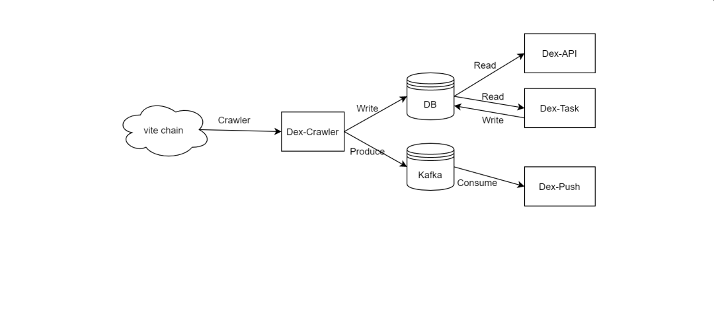

# Design and Implementation of ViteX Back-End Service

ViteX, a built-in decentralized exchange on the Vite chain, plays an important role in Vite’s ecosystem. ViteX is composed of a built-in contract (vDex) and an off-chain service (DexServer). Orders are matched in vDex, fully leveraging the benefits of blockchain — decentralization, safety and reliability. However, storing all the data on the chain is very expensive, and is not a good practice. In order to provide users with fast and efficient data query service, we designed the off-chain service DexServer, which is responsible for synchronizing open/historical orders, matching results, operational statistics and other metrics on the chain, and provides the query service.

According to responsibilities, DexServer has four sub-services: Dex-API, Dex-Crawler, Dex-Push and Dex-Task. Among all the services, Dex-Crawler is the most important, providing data sources for the other three. The entire system flow is shown in the figure.

## Dex-API

Dex-API provides the query interface for outside system, based on the final aggregation of the data generated by Dex-Crawler and Dex-Task.

## Dex-Crawler

The Crawler service is the cornerstone of the entire system. Data crawled from the chain is formatted and stored in database, for subsequent use by other services. vDex consists of two separate contracts — dexFund and dexTrade. dexFund is responsible for operations such as deposit, withdrawal, opening trading pairs, mining, dividends distribution, referrals, etc. dexTrade completes order placement, cancellation, and matching. Dex-Crawler crawls the two smart contract chains separately, processes data, and stores in multiple forms as needed.

The Crawler service completes three major functions — fork resolution, order book aggregation, and statistical indicators. There is an essential difference from the centralized trading system — rollbacks and forks naturally reside in the blockchain. Therefore, one of the primary tasks of the Crawler service is to determine whether the contract chain is forked. If it is, according to the height of the fork, some persisted data must be deleted in order to maintain synchronized with the state on the chain. Dex-Crawler uses the “previous block” of the blockchain and the database to detect whether there is a fork in the contract chain. If yes, it rolls back all the data at the height in the database to ensure consistency and correctness.

Order book aggregation is the second focus of the Crawler service. When an order is placed, canceled or matched, the order book will change accordingly. Typically, it is represented to users as the order book’s depth has changed. The reason why order book aggregation is complicated is because it needs to group the order’s quantity and amount at the given (0 to N) decimal place in price for each trading pair. In order to improve performance, we employ the methodology of “in-memory modeling” to implement the aggregator. In this way, all processing is performed in memory, and then the output data is sent to Kafka for consumption by Dex-Push.

Statistical indicators are the third focus. Whenever a new matching is completed, the indicators of Kline, Trades and Tickers will change. Since additional data sorting for different periods is required, Kline is the most complicated to implement. At present, the time periods supported in ViteX are [minute, hour, day, minute30, hour6, hour12, week]. All the indicators will subsequently be sent to Kafka for Dex-Push service’s consumption.

## Dex-Push

The job of Dex-Push is to display the data produced in the Crawler service to users in time. Cluster deployment is adopted to ensure the service is highly reliable and stable. In addition, in order to reduce server’s load, the client should initiate a ping request to the server once per minute to declare that it is alive, and the server will only send data to living clients.

## Dex-Task

This service is used for operational statistics calculation and aggregation. Statistics of trade mining, market make mining, referral mining, dividends distribution, exchange fees and others are processed offline by scheduled tasks.

This article introduced DexServer and its four sub-services. Asynchronous communications are performed between the sub-services to reduce coupling and improve robustness and maintainability of the system. In next article, I will introduce more technical details about Dex-Crawler and Dex-Task. Stay tuned.

