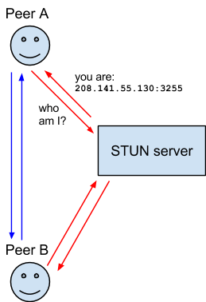
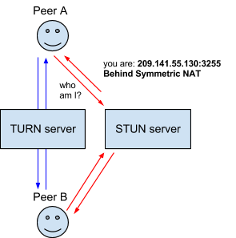
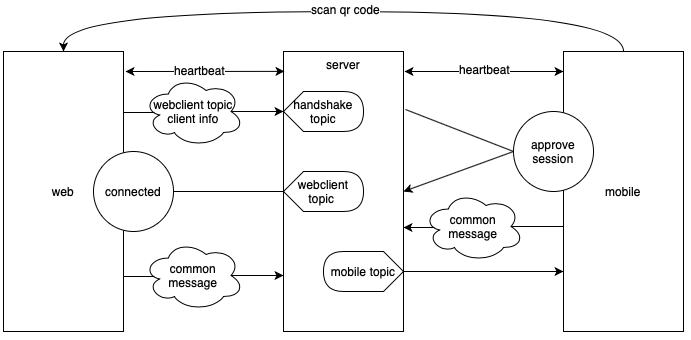

# An Introduction to Vite Connect

## Background

As more third-party gateways are integrated into ViteX, an increasing security risk has been posed due to the increasing number of third-party services. Storing mnemonic seeds (or private keys) in browser becomes insufficient. An urgent need has arisen to find a remote signing solution in order to separate mnemonics/keys from web client. As an alternative of hardware wallet, it should use the private key saved in Vite mobile app to sign transactions sent from Vite web wallet. The final solution must be safe, convenient, and easy to implement.

Let’s see two existing solutions first:

  [https://github.com/MyEtherWallet/MEWconnect](https://github.com/MyEtherWallet/MEWconnect)
 
  [https://github.com/WalletConnect/walletconnect-monorepo](https://github.com/WalletConnect/walletconnect-monorepo)
 
The major difference of the two solutions is the connection type between peers. Hereinafter I borrow some terms and diagrams from WebRTC architecture on [https://developer.mozilla.org](https://developer.mozilla.org) for illustration.

## MEWconnect

1. MEWconnect implements a similar STUN (Session Traversal Utilities for NAT) server. The server detects the NAT type of two peers and exposes the public network address of each other to both parties (Note: this cannot be achieved under some NAT types).

2. After knowing the public network addresses of each other, the two peers communicate directly.

MEWconnect has no relay server. No one has access to communication data except the two peers. However, since most 3/4G network is under symmetric NAT where P2P communication cannot be realized, MEWconnect does not meet our requirement.

## WalletConnect

WalletConnect implements a relay server like TURN (Traversal Using Relays around NAT). Once registered, the two peers are able to find each other and communicate through the relay server, so communications can be normally conducted in 3/4G network. This is the design we finally adopted in ViteConnect.

Let’s take a deeper look at the handshake process of a web client and a mobile app — the typical use scenario of ViteConnect.

## Handshake Process in WalletConnect

1. The web client generates a key and a handshake topic, then displays in the form of QR code, which also includes server’s internet address.

2. The web client sends a session request to handshake topic on the server, carrying a webclient topic, and then subscribes to the webclient topic for incoming messages.

3. The mobile app scans the QR code, connects to the server, and takes the session request from the handshake topic. After decrypting the message with the key, the mobile app is able to get the webclient topic. Subsequent messages to the web client will be published through the topic. At this time, the mobile app will send an approveSession message, carrying a mobileclient topic.

4. The web client receives the approveSession message, retrieves the mobileclient topic. Subsequent messages to the mobile app will be published through the topic.

## Features

1. All messages are encrypted. The encryption key is only known by the two parties and transparent to the server.

2. During session establishment, private topics (webclient topic, mobileclient topic) are exchanged in secure and will not be disclosed.

3. Session request is sent and consumed only once, thus ensuring that even if the contents of handshake topic and encryption key in the QR code are leaked, the attacker cannot access the private topics of the two parties.

## Existing Problems of WalletConnect

1. The encryption key is not updated during handshake. If the QR code and encrypted message are exposed, a third party can read the message.

2. Private topic is generated only once and cached locally in device. Once leaked, encrypted message can be intercepted by a third party.

3. Peers cannot see each other, further the server does not know the corresponding relation between topics. The decoupling between peer and server may reason for security purpose. However, this also brings difficulties for implementing reconnection.

4. Both server and web client use socket.readyState===1 to determine if it is ready to send the message. However, in our testing after the connection is broken, socket.readyState still keeps valid in next 5–7s. Messages during this time may be lost.

Overall, the handshake process is cleverly designed. However, lacking of reconnection mechanism, server-side message storage, and topic recycling still leaves improvement space.

## Our work

1. Because ViteX’s users are globally located, one single server would cause high latency to some users and poor stability, thus multiple distributed servers should be set up.

2. To solve the state agnostic problem between two peers, a heartbeat mechanism is introduced in ViteConnect. If the heartbeat of one party is not detected within 10s, the other party will send a disconnection message and then close the connection.

3. To recycle unused topics, ViteConnect guarantees there is only one topic for every session. Long-term (1h) unused topics will be recycled.

4. A basic monitor has been employed.

After the first version of ViteConnect was released, the peak topic number in the first day was around 3700, serving more than 1200 users at the same time.

## Optimizations in V2

According to feedbacks, in the first version messages were sometimes lost, and connections were dropped when screen lock.

This is a stability/real-time tradeoff. In a poor network environment, whether to wait for the message to arrive or disconnect connection immediately for liveness is not always easy to decide. Considering the difficulty of liveness preservation in mobile app and measuring the impact of network delay, we chose to implement the reconnection mechanism in ViteConnect.

1. Add a unique sequence number to each message, so that peers can re-subscribe from the last index after reconnecting.

2. Introduce new message types:

    a.  Session related messages. The messages should only be consumed once for security reasons.

    b.  In the purpose of connection optimization, messages between peer and server should not be encrypted.

    c.  Private messages should be kept on the server for a certain period of time, in case of topic re-subscription after reconnecting.

    d.  Topics are recycled when idling for a certain period of time.

3. Support version control. Version of message/peer should be detected by server. The server should select different processing methods when dealing with different versions of peers and messages.

## Reference materials:

[https://developer.mozilla.org/en-US/docs/Web/API/WebRTC_API/Protocols](https://developer.mozilla.org/en-US/docs/Web/API/WebRTC_API/Protocols)

[https://github.com/MyEtherWallet/MEWconnect](https://github.com/MyEtherWallet/MEWconnect)

[https://github.com/WalletConnect/walletconnect-monorepo](https://github.com/WalletConnect/walletconnect-monorepo)

[https://github.com/WalletConnect/node-walletconnect-bridge](https://github.com/WalletConnect/node-walletconnect-bridge)

[https://www.jianshu.com/p/a6713687bc1d](https://www.jianshu.com/p/a6713687bc1d)

[https://www.jianshu.com/p/ecde412d2eeb](https://www.jianshu.com/p/ecde412d2eeb)

