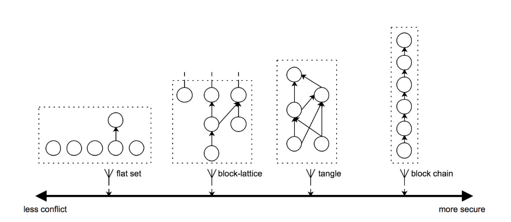
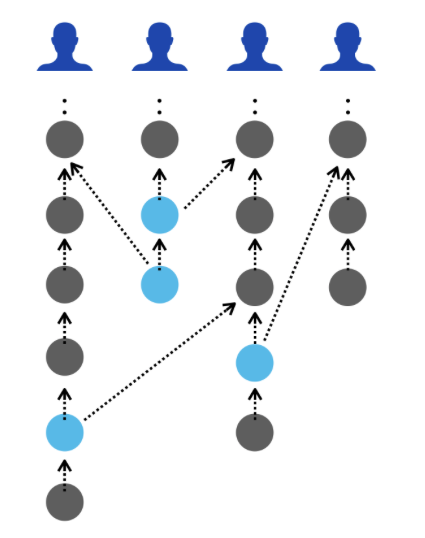

# The Interpretation of DAG Technology on Vite

## Background

DAG is an acronym for Directed Acyclic Graph. It is a method for sending data in a distributed environment. Originally, DAG is not blockchain technology, but a data structure for solving dynamic programming problems. The first person to propose this concept was Sergio Demian Lerner, who published the article [ DAG Coin Draft](https://bitslog.files.wordpress.com/2015/09/dagcoin-v41.pdf)  in September 2015, and first proposed the concept of DAG-chain. Although DAG was not created for blockchain, this decentralized network implementation is now classified in the blockchain sector. Popular projects include IOTA, Nano, ByteBall, VITE, etc. All these projects were developed from the basic DAG structure.

## The Theory of DAG Technology

In comparison to the traditional blockchain structure, DAG is no longer a single-chain. If considering the blockchain as a line, the DAG structure is a web structure, where transactions can be processed asynchronously and concurrently. With these characteristics, multiple blocks can be written into the network simultaneously. The efficiency of DAG transaction is highly increased compared to the traditional blockchain structure that only one blockchain can be produced at a time.

According to DAG structure, every transaction is directly involved in maintaining the entire network. When a transaction occurs, a new block will be generated. This new block will be added to the network and connected to the previous block. Over time, all blocks will be connected to each other and form an acyclic graph structure. Each block can be traced back to the genesis block. Thus if you want to change the data of a certain block, you need to change the data of the genesis block.

In the picture shows below, the security gradually improves from left to right, but the performance gradually decreases, resulting in a slower transaction speed. The leftmost is a combination-based structure commonly used in centralized systems. The rightmost is a typical blockchain ledger. In between are DAG structures.

## The Features of DAG Technology

DAG has the following two characteristics in comparison to traditional blockchain structure:

1. Fast speed. Blocks can be packaged in parallel to accommodate more transactions at a time with fast confirmation speed.

2. High scalability. Nodes can process transaction without waiting for data synchronization.

For most blockchain network, the bottleneck is not node processing ability, but inability to perform parallel computing. The majority of the time wasted is from idle waiting time: Part of the wait is from synchronization to all nodes when initiating a transaction; another part is the time taken to broadcast confirmation to the whole network.

There is no such problems for a DAG structure. When sending a transaction, it does not need to wait for transactions submitted before. The transaction only needs to go through local verification, network propagation, and other local verifications. These steps can be characterized as a decentralized confirmation process. In this process, every node is solving a piece of a puzzle, and connecting transactions confirmed by itself and transactions confirmed by others.

## DAG on Vite Public Chain

Vite uses a specific DAG ledger structure named Block-Lattice, where each account corresponds to a chain, and each transaction refers to the hash of the previous transaction. Transactions are split into “request transactions” and “response transactions”. A response transaction refers to the hash of its corresponding request transaction. This forms a grid-like DAG structure. This ledger structure allows unrelated transactions to be written in parallel, reducing the probability of conflicts and as a result to improve throughput.

Block-Lattice ledger also has flaws. It’s weak on tamper-resistance, which might cause hidden security risks. This is because transactions are grouped by accounts. A transaction will only be attached to the end of the account chain of which it belongs. Transactions generated by other accounts will not become successors of the account chain, so the probability of transaction being rolled back will not be decreased over time.

In order to make up for this defect, Vite introduces another chain structure called Snapshot Chain and thus improves the consensus algorithm. We will elaborate the functions of Snapshot Chain in other articles.

## Summary

DAG is a new generation of blockchain technology. The high-performance and scalability of DAG structure can just make up the shortcomings of the current blockchain structure, and bring new revolution to blockchain technology. Based on DAG structure, Vite is able to provide more easy-to-use products, and build a better ecosystem.

