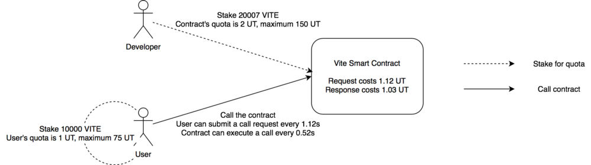
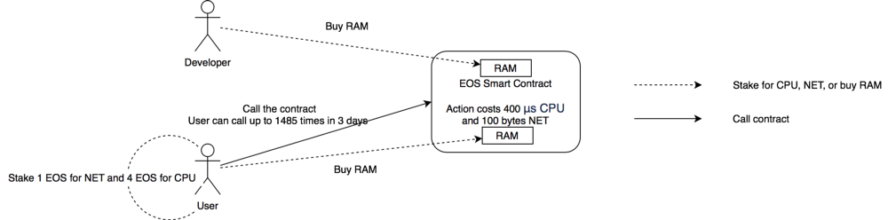
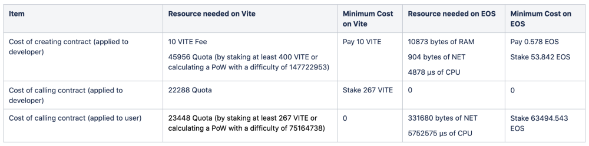

# The Economics of Smart Contract — Vite v.s. EOS


## Costs of smart contract on Vite


On Vite, the costs of smart contract depend on the resources used, including CPU, memory, network bandwidth, storage space, etc, and the resource consumption is measured in terms of quota, which can be obtained by staking VITE coin. Quota is refilled every snapshot block during the stake period. The staking size is proportional to the actual resources that are used by the contract. The more resources used, the more VITE coins should be staked.
Note: Apart of staking, Vite also supports another method of solving PoW puzzle to get free quota. It will be discussed below.
In general, the costs can be split into two parts:
— Cost of creating a contract: To create a smart contract, the contract developer needs to pay a 10 VITE deployment fee, which will be destroyed. In the meantime, a small amount of quota is consumed from the developer’s account to trigger the deployment transaction.
— Cost of calling a contract: Due to the asynchronous architecture adopted by Vite’s smart contract, both transactions of request (triggering the contract) and response (executing the contract) consume quota. The former spends quota from the user’s account, while the latter is usually secured by quota staked for the contract account by a contract developer.





## Costs of smart contract on EOS


The cost of an EOS contract is measured in three resources: RAM, CPU, and NET. RAM is on-chain storage, including account balances, public keys, staking and voting entries, contract states, etc. For example, creating an ordinary EOS account requires 4KB of RAM to store the related information. For a smart contract, RAM is used in storing contract’s code and states. Specifically, contract states are the data saved through EOS’s DB interface. This part of cost can be covered either by the contract developer or by the user, counting on how it is specified in the contract. RAM must be purchased in the secondary market, and can be recovered after the resource is released. The selling price of RAM follows Bancor Algorithm.


CPU and NET stand for CPU resource and network bandwidth on EOS. They are both obtained by staking EOS coins, and the amount of resources retrieved depends on the proportion of the stake amount of an account to the total amount of all current stakes. The amount of CPU and NET resources specifies the CPU cycles in microseconds the account is able to execute and the size of network capacity in bytes the account can leverage in the current window (a window is equivalent to 24h according to the EOS’ specification). CPU and NET are consumed for each EOS transaction, and will be restored in the next window.


The cost of an EOS contract can also be split into two parts:
— Cost of creating a contract: To create an EOS contract, the contract developer must pay RAM for storing contract states, as well as CPU and NET to launch the contract creation transaction.
— Cost of calling a contract: To call a contract, the user needs to spend CPU and NET in executing the contract call. If the contract has new contract state to store, RAM is also charged. In most cases, it’s the user who pays the RAM.





## Cost Comparison


## An Example


Let’s see a simple quiz contract.
The contract has a guess function, which takes a number ranging from 0–9. The function generates a random seed, and if the last digit of the random seed is the same as the input parameter, it prints “win”, otherwise prints “lose”.
On Vite the contract code is as follows:

```
pragma soliditypp ^0.4.2;
contract bet {
    event win();
    event lose();
    onMessage guess(uint8 target) {
        uint64 random = random64();
        if (target == random % 10) {
            emit win();
        } else {
            emit lose();
        }
    }
}
```


To create the contract:
The contract developer pays 10 VITE as deployment fee, and at least stakes 400 VITE or calculates a PoW with a difficulty of 147722953 to launch the contract creation transaction. The quota consumption is 45956.
To call the contract:
The user should stake at least 267 VITE (in this case, one call request can be triggered every 75 snapshot blocks, approximately 75s) or calculate a PoW with a difficulty of 75164738 (in this case, one call request can be triggered per snapshot block, approximately 1s). The quota consumption is 23448.
The contract developer should stake at least 267 VITE for the contract to execute a contract response for every 75 snapshot blocks, approximately 75s. The quota consumption is 22288. Ideally, the contract can process up to 3455 calls in three days.


On EOS the contract code is as follows:


```
#include <eosiolib/eosio.hpp>
#include <eosiolib/print.hpp>
using namespace eosio;
 
class bet:public eosio::contract {
  public:
    using contract::contract;
     
    [[eosio::action]]
    void guess(uint8_t target) {
      auto random = current_time();
      if(target == random % 10) {
        print("win");
      } else {
        print("lose");
      }
    }
};
```


To create the contract:
The contract developer should create a contract account that consumes 200 bytes of NET and 214 μs of CPU;
He also needs to update the contract code and ABI, consuming 704 bytes of NET and 4664 μs of CPU.
After the contract is deployed, a total of 10873 bytes of RAM are used, which costs 0.578 EOS.
To call the contract:
The user triggers a contract call transaction that consumes 96 bytes of NET and 1665 μs of CPU. To perform 3455 calls within 3 days, at least a stake of 0.338 EOS for NET and 63494.205 EOS for CPU is required.





Note: On June 11, 2020, the RAM price was approximately 1 EOS buys 18.81 KB RAM, the NET price was approximately 1 EOS gets 0.98 MB NET, and the CPU price was approximately 1 EOS gets 90.6 μs of CPU.

Comparison of staking costs between Vite and EOS under different transaction volumes (0.1 TPS means that the contract is executed once 10s):


Note: 1 VITE = 0.01538 USD，1 EOS = 2.6601 USD，1 EOS = 5167.98 EOS loan for 30 days


According to the table, to deploy the same smart contract on the two platform, the staking cost on EOS is 77240.85x of that on Vite. If the contract serves 5 requests per second, the staking cost reaches a ridiculous amount of $63,354,138.23 on EOS, with the comparison of $819.37 on Vite.


Considering the huge gap of staking cost between the two platforms, instead of staking for resources, the user can choose to borrow resources from EOSREX to reduce cost. In this case, to borrow sufficient resources for 30 days, he must pay 4608.637 EOS as rental, equivalent to $12258.97, which is still 14.96x of the staking cost on Vite.


## Summary


1. Costs are much, much lower on Vite than on EOS for smart contract;

2. Compared with EOS, Vite is extremely suitable for scenarios like high-frequent execution.


