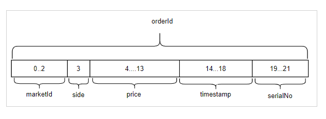
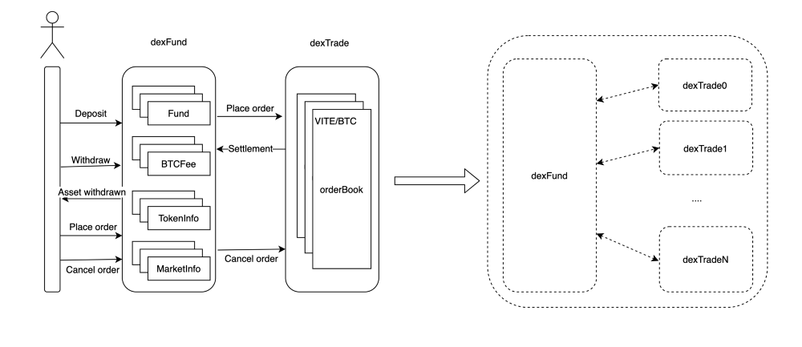

# The Design and Implementation of ViteX Contracts

ViteX is a built-in decentralized exchange on Vite. As an important component of the Vite ecosystem. ViteX consists of Vite’s built-in contract vDex and the off-chain service dexServer.

vDex is designed to perform all of the exchange’s core functions on-chain, such as deposits, withdraws, listing trading pairs, and order matching. However, subsequent on-chain functions like mining of VX coins, fee dividends and operator management have been included as well. Needless to say, all these functions are implemented with high security and full transparency of rules in mind.

The following is an introduction to several key points in the design and implementation of vDex.

## Storage Design

Particular to vDex’s implementation (as compared to that of other centralized exchanges) is the storage structure enhancements and performance of the chain itself. To maximize match efficiency, vDex has adopted multiple optimization strategies for read/write efficiency

## Order ID

The method by which orders are stored determines the read/write efficiency, and ultimately determines the order-matching efficiency.

At the lowest level, the Vite chain employs a LevelDB-like storage. It supports sequential traversal ordered by byte, which is consistent with vDex’s Taker-Maker matching rules. These rules do matching according to the price order of trading orders. vDex uses an order id format that complies with levelDB’s ordering mechanism, ensuring that Taker matching takes only one iteration to complete.

The order structure is presented below:

The order id is a 22-byte field composed of subfields as follows:

marketId: a unique identifier for each trading pair. This is auto-incremented.

side: 0 or 1 for Buy/Sell respectively. It is a 1-byte suffix to marketId. A Taker order will scan all pending Maker orders with the same prefix (marketId + side) during a matching process.

price: a 10-byte long fixed-point number. The first 5 bytes correspond to the integer part, and the last 5 bytes to the fractional part. This can support a maximum length of 12-digit integer and 12 decimals. For a sell order, prices are stored normally from low to high, whereas in a buy order, the value is flipped to represent a reversed price order from high to low.

timestamp: orders with the same price are sorted by timestamp.

serialNo: for orders with the same price and timestamp, orders are sorted according to the sequence by which the orders were confirmed on the chain, ensuring a strict order.

This 22-byte long order id serves as a key for levelDB traversal, thus providing efficient order traversal by price.

## Matching Process

The matching engine generates a new prefix from the combination of Taker’s marketId+!side. It uses this prefix to traverse through levelDB in ascending order, thus generating a list of all ranked orders in the market placed by Makers. A Taker’s order is matched when the following conditions are met: !taker.side && bytes.cmp(taker.price, maker.price) >= 0 || taker.side && bytes.cmp(taker.price, maker.price) <= 0. Any unmatched remainder is further processed until either the match fails or the transaction is completed. When a match fails, the taker’s order ID is sent to storage. The entire matching process adopts a simple and efficient way of reading/writing storage.

## Order Object Compression

To improve storage efficiency, protocol-buffers are used to serialize the order object. If sufficient compression can be guaranteed, new fields may be added to the order structure to enhance backward compatibility.

Storage can further be optimized by nulling the order ID’s four fields (marketId, side, price, and timestamp) prior to deserialization. During deserialization, only relevant fields are assigned.

## Storage Clean-up

To further reduce the occupation of on-chain storage, space is cleaned for completed matches and cancelled orders. Orders have a set timeout mechanism. Expired orders can be cancelled in batch without verification. To ensure all orders are accessible, cleared orders are persisted in dexServer service off the chain.

## Mining/Dividend Metrics Storage Optimization

vDex supports on-chain trade mining, stake mining, and handling of fee dividends. At the end of a day-by-day period, mining/dividend results are produced based on relevant metrics for the period.

To avoid unnecessary impacts on normal transactions, mining and increase of period are made asynchronous. This requires that the state at the end of each period can be traced back via, in vDex’s implementation, snapshots. To minimize the number of snapshots, state of a new period is recorded only when there is a difference with that of a previous valid period, which minimizes storage duplication.

## Multi-Contractual Collaboration

The current version of vDex consists of two built-in contracts. dexFund undertakes operations such as deposits, withdraws, listing trading pairs, mining, dividends, etc. dexTrade completes the actual order placement, be it a match or a cancel.

The design of two separate contracts facilitates system splitting and maintenance from an engineering perspective, and facilitates subsequent dexTrade sharding for higher throughput.

## Asset Correctness Check

Correctness at code level is ensured through both unit testing and integration testing.

vDex also verifies asset consistency in real time by comparing all the assets in built-in contract and the actual balance of the contract on the chain. If they are consistent, errors due to internal calculation and logic errors resulting in excessive asset issuance or loss can be ruled out.

Asset check is equivalent to performing a full integration test on all the code of vDex’s contracts. This operation can be performed periodically during test phase or after formal deployment to verify the correctness of the contracts.

## vDex and dexServer Collaboration

During the execution of the contracts, internal states are modified. Internal state changes are recorded in a eventLog and handled by off-chain service dexServer, allowing for downstream services such as monitoring and data statistics services.
