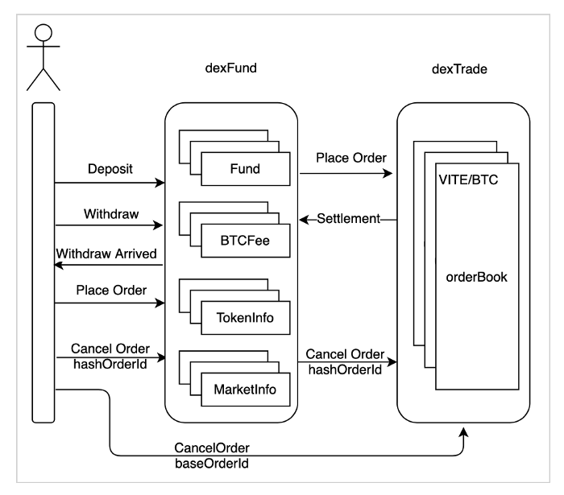

# Inside ViteX’s Built-in Contract

As a high-performance decentralized exchange, ViteX implements both matching engine and economic model in the built-in contract vDex, satisfying both design simplicity and system robustness. In the previous article “ViteX Contract Design and Implementation”, we have discussed the design details of ViteX. As a follow-up, this article focuses on a few FAQs to further explain the background, issues and solutions.

## 1. Why vDex is implemented as two contracts, not one

In ViteX, order matching and economic model are two important but irrelevant functions so that it does not make sense to put them in the same contract, which may cause confusion for developers and API users. In addition, matching engine is a basic function for exchange, it will be easy to upgrade independently after decoupling from the economic model. Based on the thought, we separated the functions as contract dexFund and contract dexTrade. DexTrade implements ViteX’s order book and order matching engine, while DexFund performs functions related to the ViteX economic model such as asset management, mining and dividends.

## 2. Why two types of order id are used

We studied the structure of order id in the previous article. The order id, referred to here as baseOrderId, is designed to maximize performance boost through on-chain order sorting and efficient matching. In the “Stem” hardfork of Vite, a new order id, hashOrderId, was added too. As the name indicates, hashOrderId is composed of the value of transaction hash in which the order is placed. Unlike baseOrderId is generated by contract, hashOrderId is created when the order is placed by user without waiting for vDex’s response, which makes it possible to be used for convenient order status tracking and perform subsequent actions accordingly. In summary, hashOrderId is often used by client program like trading bot while baseOrderId is designed for improving matching efficiency.

## 3. Why two order cancellation interfaces exist

Because the ViteX’s order book is stored in dexTrade, and to cancel an order only the order book has to be accessed, so in early version of ViteX the interface of order cancellation is in dexTrade. However, order placement is based on the dexFund contract in the purpose of locking up funds, which leads to inconsistent design for order placement and cancellation. In the actual execution of the contracts, an order, after placed, may immediately be cancelled before it is written into the order book in dexTrade due to on-chain consensus delay. At this time, the cancellation fails since the order does not exist in the order book. To address the issue, we have added a cancellation interface in the dexFund contract in recent fork “Mars”. In the new design, for an given order, the guarantee of sequence of requests on user’s account chain ensures that the cancellation request will definitely be processed by the smart contract after the order is placed. Comparing the two interfaces, the new one produces deterministic execution result at a cost of introducing an additional step to pass the cancellation request from dexFund to dexTrade, and is recommended for automated trading tools to use.

## 4. How to improve the performance of order matching

To improve the speed of order matching, the common practice is to put the best orders or all orders into memory for efficient access. However, for smart contract, due to the limited ability to access the storage provided by the blockchain, the order book cannot reside in memory. At this time, one way to consider is to make full use of the underlying storage to ensure that the order book is stored in an orderly manner, so that the matching process only requires sequential iteration. By using price as part of order id and using order id as the storage key of levelDB, the matching process can be completed by a simple key sequence traversal. This solution is simple and highly efficient.

## 5. How to reduce storage occupation

The cost of on-chain storage is extremely high. In order to minimize data storage, we have adopted the following approach. First, serializing objects through Protobuf to reduce the size of data. Second, avoiding redundant data storing. It is mainly reflected in the processing of indicators related to mining and dividends. If an indicator has not changed for a time, only the earliest value is stored. Third, using both real-time cleanup and regular cleanup. For the multi-version indicators accumulated in mining and dividends, old data are deleted in real time for the indicators have been updated. Regular cleanup applies to order book. In order to avoid unlimited expansion of the order book, a timeout timestamp is set for each order and expired orders will be recycled regularly.

## 6. How to increase the reliability of vDex

As built-in contract, each line of code of vDex is written protocol. Simplicity and reliability must be fully addressed. Over-design would increase the code size unnecessarily, as well as the number of bugs and errors in the end. Based on the principle of simple design, the data structures of vDex are as simplified as possible. Only core data that usually won’t change are stored on chain and other non-related information is stored off-chain. ViteX’s off-chain data service supports sophisticated query and data display. At the code level, we restrict the number of lines of code for a single function. By splitting functions, naming function with meaningful name, code duplication is also reduced. The target is to make the code clean and easy to read. Finally, the built-in auditing function will regularly verify the correctness of contract execution result, ensuring the safety of user’s assets.
