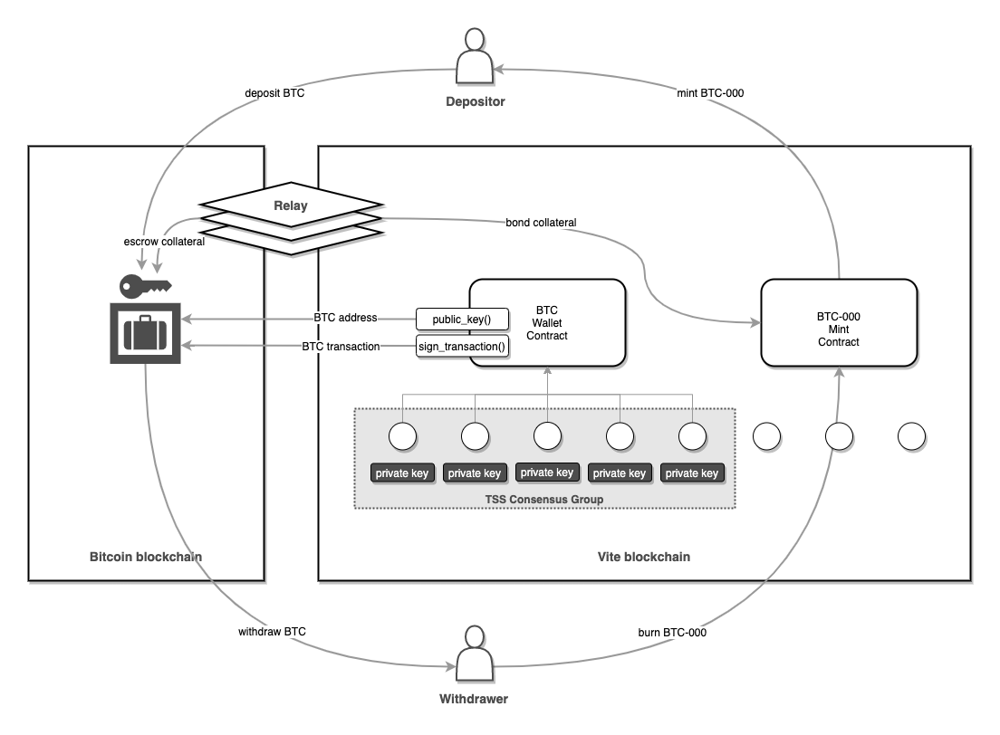
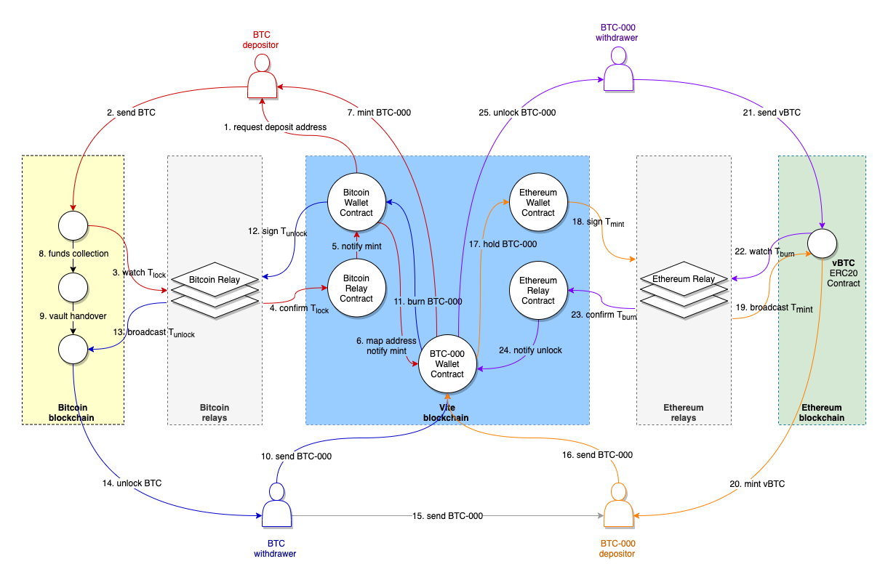
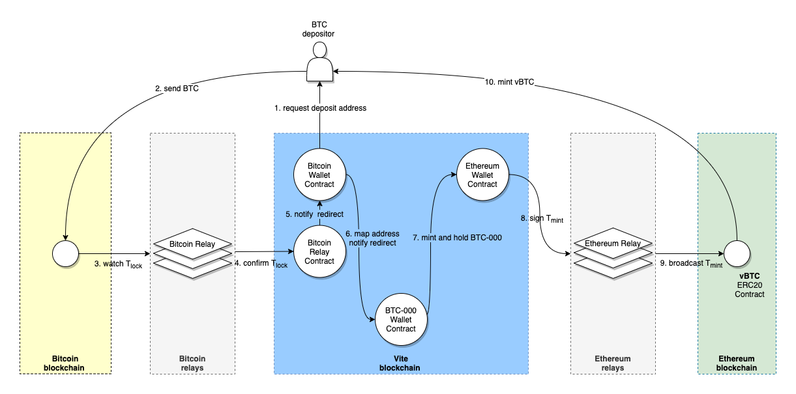

# ViteBridge: A Generic Decentralized Cross-Chain Transfer Protocol 

## Background
In recent years, many public blockchain projects have been created, but almost all of them have been built to become closed ecosystems.

This means when users make transactions or use dApps, these actions are only of a trustless nature when performed within the same protocol.

As such, independent blockchains have become isolated islands of both data and digital assets. The space is screaming for an effective and trustless cross-chain protocol.

This paper proposes a generic and decentralized cross-chain transfer protocol to bridge all blockchains. This protocol will allow unconstrained transfer of information and value between heterogeneous ecosystems, and push our industry towards more openness and interoperability.

## Design Goals
- **Generic**. The protocol is not designed for specific blockchains but should apply to most existing blockchains.
- **Decentralized**. The protocol must minimize the trust required from any single party in the system. Anyone can join or leave freely according to the rules established by the protocol.
- **Secure**. The protocol must be Byzantine fault-tolerant and maximize security in confrontation with various attacks.

## Related Works
Currently, the schemes of cross-chain transfer protocol can mainly summarize into the following categories:

### Top-Level Protocol Approaches
By providing a top-level cross-chain protocol, all transfers between blockchains that build on the protocol are supported.

[Cosmos](https://cosmos.network/) and [Polkadot](https://polkadot.network/) are based on this solution to provide cross-chain interoperability.

This solution can only provide interoperability between the blockchains within the ecosystem, but it cannot support the existing heterogeneous blockchains (such as Bitcoin and Ethereum). Moreover, the different top-level protocols are not compatible with each other.
At the current stage, it is still too far from having a universal protocol that can be accepted by the whole blockchain industry.

### Single Custodial Approaches
A trusted centralized organization manages the assets on many different blockchains through one or a set of private keys and supports cross-chain transfers between the blockchains.

[Coinbase Custody](https://custody.coinbase.com/), [Bitgo](https://www.bitgo.com/) and [Vite Gateway](https://vite.wiki/dex/api/gate.html) are based on this scheme.

This solution is effective and is suitable for most blockchains. However, it cannot meet the goals of decentralization and security.

### Federated Custodial Approaches
A group of trusted centralized entities jointly manage assets on the blockchain and realize cross-chain transfers between blockchains.

[Liquid](https://blockstream.com/liquid/) is an inter-exchange settlement network based on a federated custodial approach. Bitcoin is locked by 15 signers including exchanges and liquid providers authorized by Blockstream.

[WBTC](https://wbtc.network/) is a Bitcoin-backed ERC-20 token on Ethereum. This is still a centralized solution, but instead of relying entirely on one authority, it relies on a consortium of organizations performing different roles in the network.

Although this type of solution introduces multiple custodians to improve security, it is still centralized in nature and does not meet the goal of decentralization.

### Cryptographic Approaches
This approach leverages a smart contract on one blockchain to verify whether the transaction on the other blockchain is confirmed. The smart contract serves as a light client of the remote blockchain, and it does not verify the entire block but only the block headers or a Merkle root.  

[Waterloo](https://blog.kyber.network/waterloo-a-decentralized-practical-bridge-between-eos-and-ethereum-1c230ac65524) is a decentralized bridge between EOS and Ethereum. It implements a light client for EOS that only needs to maintain a set of block producers and an algorithm to verify Ethereum PoW hash functions based on the SmartPool algorithm.

[ETH-NEAR Rainbow Bridge](https://near.org/blog/eth-near-rainbow-bridge/) implements EthOnNearProver, a NEAR contract in Rust, and NearOnEthProver, which is written in Solidity and deployed on Ethereum. EthOnNearProver can verify Ethereum events, while the NearOnEthProver contract verifies NEAR contract execution results on Ethereum.

[tBTC](https://docs.keep.network/tbtc/) is a design for a decentralized, one-to-one redeemable token pegged to BTC. To prove a deposit, the depositor submits proof that the transaction was included in a valid Bitcoin block with sufficient subsequent accumulated work. The proof is verified by an SPV smart contract on the host blockchain such as Ethereum.

[Incognito](https://we.incognito.org/t/shielding-cryptocurrencies-turning-any-cryptocurrency-into-a-privacy-coin/83) is a platform of decentralized privacy coins. Through Incognito, a public coin can be shielded to obtain its privacy coin counterpart of the same value. Incognito validators verify the shielding transaction and the deposit proof inside it in particular by using SPV.

Such solutions meet the goals of decentralization and security. However, they are not generic enough.
Due to the serious challenge of designing a light client for PoS blockchains, it has no efficient way to validate the suffix blocks of those blockchains without the signatures of stakeholders, which depends on the recent stake distributions and cannot be verified externally.

### Game-Theoretic Approaches
This approach assumes that the user is always rational and selfish. Through a moderate economic model and rules design, the protocol can achieve game-theoretic security.

[RenVM](https://github.com/renproject/ren/wiki) uses bonding and algorithmically adjusted fees to make sure that attacks are never profitable and to make sure that it can always restore the one-to-one peg if an attack ever does succeed. 

[tBTC](https://docs.keep.network/tbtc/) requires a bond per deposit from each backing signer because signers are able to collude to censor withdrawals or abscond with funds. Bonded signers offer depositors recourse in the case of colluding signers interfering with operation.

[Incognito](https://we.incognito.org/t/shielding-cryptocurrencies-turning-any-cryptocurrency-into-a-privacy-coin/83)‘s custodian must bond some collateral (ETH or liquid ERC20) into the Bond smart contract with Collateral-to-Deposit ratio is initially set as 150%. So custodians do likely have a motivation to return original public coins to the redeemer.

Such approaches meet the goals of genericity and decentralization. But they are more vulnerable than cryptographic schemes.

## Introduction
### Tradeoffs
- We are not going to propose a top-level protocol that requests every blockchain project to follow. We believe in a future where many blockchains will blossom to serve different needs. So easy transfer of data and assets between blockchains will become increasingly important. Creating a generic top-level protocol is not a prioritized task. In fact, any attempt to build such a new protocol will only introduce yet another closed ecosystem. Therefore, we choose not to ask for other blockchains to follow our specifications. But on the contrary, we have designed Vite to bridge every blockchain in a decentralized manner.
- Due to the significant inherent differences of blockchain projects, many blockchains do not have smart contract VMs. We do not intend to bridge any two blockchains directly. Instead, we will use Vite as a relay chain to forward bi-directional cross-chain transfers between two blockchains.
- It is impossible to leverage an existing blockchain, such as Ethereum, to accomplish the same goal because Ethereum lacks a few necessary features. For example, Ethereum cannot hold a secret or sign transactions in smart contracts. Meanwhile, it does not support additional signature algorithms such as Ed25519 in the EVM either. Therefore, we decide to upgrade the current Vite protocol to implement the above features.
- Vite Mainnet launched in September 2019. As a battle-hardened blockchain, some features of Vite are very suitable for cross-chain transfer. Benefited from the asynchronous smart contracts, cross-chain deposits and withdrawals can be perfectly implemented on Vite. For example, in a withdrawal case, when the confirmation number of the backed asset burning transaction reaches a given number, a member function of a smart contract is executed by the consensus group to unlock original assets on the remote blockchain. 
- Considering genericity, this protocol does not implement cryptographic light clients in smart contracts on the remote blockchain. Instead, it adopts a game-theoretic scheme to verify remote blockchain transactions through a set of relays bonding adequate collateral. Relays that failed to perform duties will bear the loss of the collateral.
- Also based on the consideration of genericity, the protocol does not require smart contracts on remote blockchains. As long as TSS or Multisig is supported, this protocol can be applied.
- Decentralization first matters. Regardless that a few tradeoffs are made in pursuit of genericity, this protocol is designed not to rely on the trust of any single organization or individual, and using the protocol does not require permissions from any party.

### Protocol Overview
The following figure outlines the architecture of the protocol:


- The protocol consists of a set of smart contracts deployed on the **Vite** blockchain and a set of relay nodes running off-chain programs.
- The Wallet contract takes the role of a **decentralized wallet** of the remote blockchain that is featured to generate public keys, construct remote blockchain transactions, and sign the transactions within the contract.
- The Wallet contract deploys on the **Vite** blockchain. It also designates a *consensus group*, whose members *hold the private keys* in a decentralized manner to ensure no single party knows the complete private key.
- The members of the consensus group are voted on the Vite blockchain. Anyone can join or leave freely without permission.
- The relay node is responsible for reporting transactions on the remote blockchain and minting *backed assets* on Vite. Relays must bond collateral in advance during registration and add additional collateral for each excess deposit if required.

### Contributions
The main contributions of this paper include:
- Propose a solution to realize **a decentralized wallet** of **any** blockchain through smart contracts. This solution allows the **decentralized custody** of assets on another blockchain.
- Propose a protocol to control the issuance of backed assets through **over-collateralizing original assets** on the remote blockchain. The protocol achieves game-theoretic security via equilibrium, through a game with perfect information between the asset issuer and the stakeholders.

## Definitions
- **Backed Asset:**
A backed asset is a crypto asset issued on a blockchain by taking another crypto as collateral. The backed asset is redeemable for the original asset on demand.
The value of a backed asset is 1:1 pegged to the original asset.
The amount of collateral should reflect the circulating supply of the backed asset.
For example, BTC-000 is a BTC-backed asset issued on the Vite blockchain.

- **Original Asset:**
An original asset is a backing asset of the backed asset. For example, the original asset of BTC-000 is BTC.

- **Origin Blockchain:**
An original blockchain is a blockchain on which an original asset stores. For example, Bitcoin is the origin blockchain of BTC.

- **Host Blockchain:**
A host blockchain is a blockchain on which a backed asset stores. For example, Vite is the host blockchain of BTC-000.

- **Vite:**
[Vite](https://github.com/vitelabs/whitepaper/blob/master/vite_en.pdf) is a DAG-based blockchain that features zero-fee transactions and optimizes for transaction speed, reliability, and security. It installs a smart contract VM and a built-in DEX with on-chain order books.

- **Remote Blockchain** 
A remote blockchain is a blockchain that connects to Vite through ViteBridge.

> **Note**:
>
> Vite does not always serve as the host blockchain. For example, when a BTC-backed asset is issued on Vite, Vite is the host blockchain, and the remote blockchain (Bitcoin) is the origin blockchain. On the contrary, when a VITE-backed ERC20 token is issued on Ethereum, in this case, Vite becomes the origin blockchain, and Ethereum is the host blockchain.

## Asynchronous Transfer Model
A token transfer on Vite includes two transactions, ***T<sub>send</sub>*** and ***T<sub>receive</sub>*** . For example, if Alice wants to transfer 10 VITE to Bob, she should submit a *T<sub>send</sub>* transaction first. When the transaction is confirmed, 10 VITE will deduct from Alice's account. At this point, Bob has not received the 10 VITE, and Alice's transfer is marked as *in transit* in the ledger. When Bob sees *T<sub>send</sub>* in the ledger, he should initiate a *T<sub>receive </sub>* transaction to receive it. After *T<sub>receive</sub>* is confirmed in the Vite network, the 10 VITE will finally add to Bob's account.

On Vite, Alice and Bob both have their *own blockchains* (Account Chain). There is no **synchronized world state** on Vite, and the account states of Alice and Bob are independent.

This model is especially suitable for cross-chain transfer. Because the ledger states of different blockchains are isolated, it is impossible to change the state of two blockchains simultaneously within one transaction.

A **cross-chain deposit** can split into two asynchronous transactions, *T<sub>send</sub>*, which represents as *T<sub>lock</sub>* that takes place on the origin blockchain in order to lock the original asset, and *T<sub>mint</sub>*, serving the role of *T<sub>receive</sub>* that occurs on the host blockchain in the purpose of issuing backed assets.

Similarly, a **cross-chain withdrawal** can also be separated into two async transactions. *T<sub>send</sub>* works as *T<sub>burn</sub>* on the host blockchain to burn the backed asset, while *T<sub>receive</sub>* becomes *T<sub>unlock</sub>* on the origin blockchain, so as to unlock the corresponding original asset.

The asynchronous transfer model must follow the rules as below:
- A *T<sub>receive</sub>* is always **paired with** a *T<sub>send</sub>* transaction.
- A *T<sub>receive</sub>* **comes eventually** after a *T<sub>send</sub>* takes place.

This rules is crucial. The first rule ensures the **safety** of the protocol. Backed assets should never be minted in the absence of real deposits, and original assets can only unlock upon actual withdrawals. The second rule guarantees **liveness** of the protocol. After a certain period, the depositor will always get the backed asset, and the withdrawer will finally get the original asset.

> **Note**:
>
> The asynchronous transfer model is different from *atomic swap* model. In atomic swap model, both transactions occur at the same time or neither.
>

## Problem Abstraction
In general, a cross-chain transfer protocol mainly answers the following questions:
- **Lock Transaction Verification**: How to verify that a *T<sub>lock</sub>* is confirmed on the remote blockchain.
- **Mint Transaction Creation**: How to generate a valid *T<sub>mint</sub>* on the host blockchain based on *T<sub>lock</sub>*.
- **Burn Transaction Verification**. How to verify that *T<sub>burn</sub>* is confirmed on the host blockchain.
- **Unlock Transaction Creation**. How to generate a valid remote blockchain transaction *T<sub>unlock</sub>* based on *T<sub>burn</sub>*.

The goal of this paper is to establish a bi-directional cross-chain transfer protocol between Vite and the remote blockchain. In the first case, Vite is the *host blockchain*, and the remote blockchain is used as the *original blockchain*; in the second case, Vite is the *original blockchain*, and the remote blockchain becomes the *host blockchain*.

Let us consider the first case, using Vite as the host blockchain and issuing backed assets of the remote blockchain on Vite.

### Lock Transaction Verification
How to verify that *T<sub>lock</sub>* issued by the depositor is confirmed on the remote blockchain?

The perfect solution is to allow each Vite full node to keep a copy of the ledger of the remote blockchain and utilize Vite's *snapshot chain* to confirm the transaction. It requires to implement a full node of the remote blockchain on Vite.
In this way, any *T<sub>lock</sub>* can be verified in the Vite network. Unfortunately, this solution is overkill and cannot be applied in reality because it is impossible for each Vite node to also become a full node for all the remote blockchains.

So, is it possible to replace with light clients and only maintain the partial state, such as block headers or a Merkle root, of the remote blockchain on Vite?
This solution works for some remote blockchains, such as Bitcoin or Ethereum, by using additional cryptographic verification to improve system security. We will introduce this solution in the ***Augmented Transaction Verification*** section later.

However, for most POS blockchains, it is very hard to implement light clients. So, in this case, this approach does not apply. 

A more general solution is to introduce a set of *relay nodes* that keep a complete ledger of Vite and the remote blockchain locally. Relays are responsible for verifying *T<sub>lock</sub>* on the remote blockchain.

The integrity of relays is guaranteed by collateral bonding, and any fraud attempt will lead to collateral losses. In some cases, even the relays conspire or collude, the losses they suffer will be much larger than the money they could abuse.

How the relays verify transactions on the remote blockchain is a key point of this paper, which will be explained in detail in the follow-up sections.

### Mint Transaction Creation
How to generate a valid Vite transaction *T<sub>mint</sub>* according to *T<sub>lock</sub>*?

The minting of backed assets is performed through a smart contract deployed on Vite.

The backed asset is the *redeemable token* issued on Vite. As a specific token for ViteBridge, it has no other way to mint except in the smart contract.

### Burn Transaction Verification
How to verify that *T<sub>burn</sub>* is confirmed on Vite?

It is also realized through the smart contract on Vite.

After the withdrawer sends the backed asset to the contract, these redeemable tokens will be burnt.
The *T<sub>burn</sub>* transaction must be confirmed (after necessary snapshots) before any subsequent step can proceed.
Luckily, the presence of asynchronous smart contracts on Vite makes the above process easily accomplished. 

### Unlock Transaction Creation
How to generate a valid remote blockchain transaction *T<sub>unlock</sub>* according to *T<sub>burn</sub>*?

Our solution is to implement a **wallet smart contract** on Vite to manage remote blockchain's assets in a decentralized manner.
This wallet smart contract can assemble a valid transaction and sign it in correspondence with the remote blockchain protocol.

It is another focus of this paper and will be described in detail later.

## Workflows
The following figure describes several key workflows of the protocol by using Vite as the host blockchain and the original blockchain respectively.

- Suppose a BTC backed token BTC-000 is issued on Vite. At this time, Bitcoin is the original blockchain, and Vite is the host blockchain.
- Suppose an ERC20 contract is deployed on Ethereum and a BTC-000 backed token vBTC is issued. At this time, Vite is the original blockchain, and Ethereum is the host blockchain.

Below we separately describe the processes of cross-chain transfer of BTC between Bitcoin and Vite, and between Vite and Ethereum.



### Transfer from Bitcoin to Vite
1. The depositor requests a BTC deposit address from the *Bitcoin Wallet* contract according to his Vite address.
2. The depositor initiates a transaction on Bitcoin and transfers BTC to the deposit address.
3. The *relay* discovers that the deposit address has received BTC.
4. After the transaction is confirmed, the relay node reports a *T<sub>lock</sub>* to the *Bitcoin Relay* contract.
5. After the *T<sub>lock</sub>* transaction has been reported by a quorum of relays, it is regarded as confirmed on the Bitcoin blockchain. At this time, the *Bitcoin Wallet* contract will be notified.
6. The *Bitcoin Wallet* contract looks up the Vite address according to the depositor's BTC deposit address, and then notifies the *BTC-000 Wallet* contract to mint the BTC-000 tokens.
7. The *BTC-000 Wallet* contract mints an equivalent amount of BTC-000 and sends them to the depositor’s Vite address.

### Vault Transfers
8. In order to facilitate subsequent unlocking of funds for withdrawals, it is necessary to collect funds scattered in different deposit addresses and aggregate them into a single vault address.
9. When the *TSS consensus group* is at the end of term, a new vault address will be generated. At this time, the old vault address will be discarded and all funds will be transferred to the new vault.

### Transfer from Vite to Bitcoin
10. In a withdrawal process, a user holding BTC-000 can initiate a withdrawal transaction on the Vite blockchain, sending BTC-000 tokens to the *BTC-000 Wallet* contract, with his Bitcoin address to receive BTC.
11. The *BTC-000 Wallet* contract burns the received BTC-000 tokens and waits until the *T<sub>burn</sub>* transaction obtains enough confirmations, then notifies the *Bitcoin Wallet* contract to unlock the equal amount of BTC.
12. The *Bitcoin Wallet* contract assembles a *T<sub>unlock</sub>* transaction of Bitcoin and sign it.
13. The *relay* obtains the signed Bitcoin transaction and broadcast it to the Bitcoin network.
14. After *T<sub>unlock</sub>* is confirmed, the withdrawer receives the original BTC in his Bitcoin address.

### Internal Transfers
15. As a native token issued on Vite, BTC-000 can be freely transferred between Vite addresses.

### Transfer from Vite to Ethereum
16. In a cross-chain scenario, BTC-000 token holders can transfer it to Ethereum to obtain the equivalent *vBTC*, which is a BTC-000 backed ERC20 token issued on Ethereum. At this point, the depositor can initiate a transaction on Vite, sending BTC-000 to the *BTC-000 Wallet* contract, with his Ethereum address to receive vBTC.
17. At this time, unlike the withdrawal process, the *BTC-000 Wallet* contract does **not burn** the received BTC-000 tokens, but **lock** them in the contract as the reserve for vBTC. When *T<sub>lock</sub>* has obtained enough confirmations, the *Ethereum Wallet* contract will be notified to unlock the corresponding vBTC.
18. The *Ethereum Wallet* contract assembles a *T<sub>mint</sub>* of Ethereum and sign it. This transaction will be sent to the *vBTC ERC20* contract on Ethereum.
19. The *relay* fetches the signed Ethereum transaction and broadcast it to the Ethereum network.
20. After the *vBTC ERC20* contract on Ethereum receives the transaction, it verifies the signature according to the public keys of the *TSS consensus group*. If the verification passes, the same amount of vBTC will be minted and sent to the user's Ethereum address.

### Transfer from Ethereum to Vite
21. Holders of vBTC can initiate a cross-chain withdraw transaction, by calling the *vBTC ERC20* contract on Ethereum, to redeem an equivalent amount of BTC-000 on Vite. The *vBTC ERC20* contract will deduct the vBTC from the user's balance and burn them.
22. The *relay* discovers a *T<sub>burn</sub>* transaction of the *vBTC ERC20* contract on Ethereum.
23. When *T<sub>burn</sub>* is confirmed, the relay reports it to the *Ethereum Relay* contract on Vite.
24. After the *Ethereum Relay* contract has been reported by a quorum of relays, the *T<sub>burn</sub>* transaction is regarded as confirmed, and the *BTC-000 Wallet* contract will be notified to unlock BTC-000.
25. The *BTC-000 Wallet* contract unlocks an equivalent amount of BTC-000 and sends them to the user's Vite address.

## Wallet Contract
In this section, we discuss how to implement a decentralized *wallet* of a remote blockchain through Vite smart contracts, so as to manage assets on the remote blockchain in a decentralized manner. The contract has the following features:
- According to the beneficiary address provided by the depositor, an unique deposit address is generated. Depending on the remote blockchain's protocol, the deposit address can be an address, or a tuple of ```(address, memo)```.
- Maintain address mapping and look up the corresponding beneficiary address of *T<sub>mint</sub>* after receiving a *T<sub>lock</sub>* notification from the Relay contract.
- Assemble a transaction for the remote blockchain in the correct format.
- Sign a remote blockchain transaction.

For the general purpose of the protocol, the smart contract should *hold a private key*, so as to generate addresses and sign transactions based on the remote blockchain's protocol.
In the meantime, in order to keep the protocol decentralized, not any single node of the host blockchain has opportunity to know the private key of the contract.

It is not easy for common blockchains because typical smart contracts cannot hold a secret. But thanks to the presence of *Consensus Group*, the *Wallet Contract* can be implemented on **Vite**.

### Consensus Group
On Vite, each *contract* is assigned to a *consensus group*, and the nodes constituting the consensus group are selected according to protocol rules. For example, the stakeholders of VITE token vote for the top *N* nodes in the group.

Only nodes in the consensus group can produce blocks for the contract. To complete this job, they execute the contract's code and return a correct result that can be verified by other nodes in the Vite network.

Why is consensus group so important? Let's look at several scenarios.
1. Multiple users call a contract simultaneously. In this scenario, the contract must prioritize the requests. For example, two users submit orders to a DEX contract at the same time, if there is no rule specifying the order of processing, it will cause the *front-running* vulnerability.
2. Generate a safe random number in a decentralized manner.
3. Sign a message in a smart contract.

On a blockchain without consensus groups, such as Ethereum, the scenarios cannot be handled well.

1. In a DEX on Ethereum, after a trading transaction is broadcasted, a front-runner can quickly place another order at the same price with a higher gas price. Since the execution order of the transactions is determined by miners, the first transaction will be suppressed because miners always choose transactions with higher fees.
2. A third party can deploy a VRF-based random number generator contract on Ethereum, such as [Chainlink VRF](https://docs.chain.link/docs/chainlink-vrf). The random numbers can be verified on chain, but the nodes participating in the random number generating are determined by Chainlink's off-chain rules, which will not go through the on-chain consensus of Ethereum.
3. Ethereum can only verify signatures in the contract. Signing a message in the contract is not supported.

In contrast, we can easily implement the scenarios through consensus groups on Vite.

#### Contract Request Ordering
The consensus group defines a rule to sort incoming requests, for example, sort by the hash of request transaction, to prevent front-running.

#### Random Functions
The consensus group uses VRF (Verifiable Random Function) to generate random numbers that will be used in the contract. It communicates with the smart contract through specific built-in functions and ViteVM instructions.
- A node in the consensus group generates a random seed at local and publishes the proof to the Vite network.
- After a certain period, the consensus group node releases the previously generated random seed to the Vite network, and other nodes can verify based on the proof they received earlier.
- A smart contract requests a random number by calling the built-in function ```random64()``` or ```nextrandom()```.
- The two functions are compiled into ViteVM code instructions ```0x4A OP_SEED``` and ```0x4B OP_RANDOM```.
- A user initiates a *T<sub>request</sub>* transaction to call the contract. The contract will not be executed until the transaction is confirmed to ensure the execution will not revert.
- When the VM executes instruction ```0x4A OP_SEED``` or ```0x4B OP_RANDOM```, it obtains a random seed according to the height of *T<sub>request</sub>* and generates a random number based on it.

#### Sign messages in Smart Contract
By leveraging distributed off-chain computation, the consensus group signs the data within the contract according to a specific signing rule. For example, among *M* nodes in the consensus group, *N* (*N* < *M*) nodes can collaborate and generate a valid signature.

The following conditions must be satisfied to produce a decentralized signature:
- To prevent fraud, any node in the Vite network can verify the membership of the consensus group.
- The members of the consensus group are voted every a certain time has passed. New members do not need permission from old ones to join.
- No single node in the consensus group can obtain the complete private key. Even if multiple nodes conspire, they still cannot assemble a valid signature.

### TSS Consensus Group
Below we take use of TSS (threshold signature scheme) to construct a consensus group, generate a public key, and sign transactions for smart contracts in a decentralized manner.

The workflow is as follows:
- The consensus group executes *TSS Key Generation* to create a public key and a set of private keys for each node in the group, then publishes the public key to the Vite network. The private keys will be used for subsequent signing. This process requires ad-hoc peer to peer communications between nodes in the consensus group.
- The membership of the consensus group has a fixed **term**. When it expires, the protocol will select a new group of nodes according to the consensus rules, then calls *TSS Regroup* to generate a new public key and new private keys, and finally publishes the public key to the Vite network.
- It is necessary to set up a transition period for group handover. During the time, the old members of the consensus group cannot quit immediately, but they still need to process incoming signing requests.
- Every time the consensus group is changed, it sends a ```tssRegrouped``` message to notify the smart contracts.
- The smart contract calls the Vite built-in function ```tss_pubkey(uint epoch)``` to obtain the public key of the consensus group. The ```epoch``` parameter specifies the term of the consensus group.
- The smart contract signs a transaction by calling the Vite built-in function ```tss_sign(unit epoch, bytes32 data)```. The ```epoch``` parameter specifies the term of the consensus group that will be used to sign the transaction. The signature will not return immediately. Instead, the consensus group will send an asynchronous ```tssSigned``` message to the smart contract to return the signature.

### Deposit Address
In order to map *T<sub>lock</sub>* on the original blockchain to *T<sub>mint</sub>* on Vite, it is necessary to create different mapping schemes according to the protocols of the original blockchain.

First of all, the original blockchain should support at least one of the following features: Smart contracts, Multi-sig, or TSS, in order to implement a decentralized wallet based on smart contracts on Vite.

For original blockchains that support smart contracts, a deposit can be sent to the contract address including a valid beneficiary address as parameter.

For original blockchains that do not support smart contracts, there are usually two ways to generate a deposit address:
1. Original blockchain supports memo or other user-customized fields in a transaction. In this case, a shared deposit address can be generated through the Wallet contract, and the depositor should specify the beneficiary address in the memo.
2. Original blockchain does not support memo fields in the transaction. In this case, a separate deposit address is generated for each user through the Wallet contract, and the address mapping between deposit address and benificiary address is stored in the Wallet contract in order to identify different users.

Below we take Bitcoin as an example to introduce how to generate a separate original blockchain deposit address for each user in the Wallet contract.

Every Bitcoin transaction contains *Bitcoin Script*, which can be used to carry custom data. However, adding a beneficiary address directly to the locking script of *T<sub>lock</sub>* requires that the depositor must use a specific wallet software to sign the transaction, which is not user-friendly.

In *BIP16*, Bitcoin introduced P2SH (Pay to Script Hash) transactions to simplify the locking script. Therefore, we choose the P2SH address as the deposit address, so that users can use any client that supports BIP16 to initiate a deposit, including from a crypto exchange.

The deposit address generation scheme is as follows:
```
// Redeem script
<recipient_address_hash>
OP_DROP
<tss_pubkey>
OP_CHECKSIG

// Locking script
OP_HASH160
<20-byte hash of Redeem Script>
OP_EQUAL

// Unlocking script
<tss_signature>
<redeem script>
```
In the redeem script, the hash of beneficiary address will be pushed into the stack and popped up immediately. The instructions here are only used to distinguish different depositors and have no influence on the unlocking process.

```tss_pubkey``` is the TSS public key of the consensus group. It is returned by calling the Vite built-in function ```tss_pubkey_secp256k1()``` in the Wallet contract.

When the members of the consensus group are changed, ```tss_pubkey``` is changed, causing all deposit addresses to be invalid. Therefore, it is important to show the expiration time of the current deposit address on the client UI.

### Refund
If the depositor transfers funds to an expired deposit address, the funds may lose. To avoid this situation, we can add a *Time Lock* to enable refund after a timeout. The modified redeem script is as follows:
```
// Redeem script	
OP_IF
    <beneficiary_address_hash>
    OP_DROP
    <tss_pubkey>
    OP_CHECKSIG
OP_ELSE
    <deposit_timeout>
    OP_CHECKSEQUENCEVERIFY
    OP_DROP
    <jury_pubkey>
    OP_CHECKSIG
OP_ENDIF

// Locking script
OP_HASH160
<20-byte hash of Redeem Script>
OP_EQUAL

// Unlocking script - Unlock transaction
<tss_signature>
<TRUE>
<redeem script>

// Unlocking script - Refund transaction
<jury_signature>
<FALSE>
<redeem script>
```

As shown in the example, a Time Lock is added to the redeem script. If a *T<sub>lock</sub>* transaction exceeds the deposit_timeout, a refund transaction will initiate to transfer the assets to *ViteBridge Jury*'s account.
In order to get refund, the depositor should submit a support ticket and attach deposit proof. Jury will review the proof and return funds to the depositor.

### Funds Collection
If a multi-address deposit approach is adopted, the original assets will scatter in multiple accounts, and these funds need to be gathered regularly and aggregated into one account. This aggregate account is called *Vault Account*, which is generated by the Wallet Contract and is used to unlock funds while withdrawing.

The funds collection code is written in the Wallet Contract, and a reasonable policy should be set up according to the throughput and cost on the original blockchain. For example, in Bitcoin, it is reasonable to collect multiple funds by specifying multiple inputs in one transaction. We can also put this step in the *T<sub>lock</sub>* of withdrawal to save more transaction fees.

For each collection process, the Wallet Contract is required to generate and sign a original blockchain transaction, which is shortly broadcast to the original blockchain by relay nodes.

The funds collection process consumes a certain cost, which should be covered in cross-chain transfer fees.

### Vault Handover
Since the members of the consensus group change regularly, a new vault account must be generated from time to time. In this case, all the original assets that are locked in the previous vault should be transferred to the new vault.

By leveraging the asynchronous smart contract on Vite, we can monitor the ```tssRegrouped``` message and deal with vault handover in the message listener. The pseudo-code is as follows:

```javascript
contract Wallet {
    uint currentEpoch;
    mapping(bytes32 => RemoteBlockchainTransaction) transactionsToSign;
    address relayContract = address("vite_000...");
    message relayTransaction(uint epoch, RemoteBlockchainTransaction transaction);

     // Message listener for tssRegroup messages triggered by TSS consensus group
    onMessage tssRegroup(uint nextEpoch) {
        if (nextEpoch > currentEpoch) {
            // fetch new TSS public key of the next epoch
            bytes32 tssPubkey = tss_pubkey(nextEpoch);
            // create vault_handover transaction
            RemoteBlockchainTransaction tx = createVaultHandoverTransaction(tssPubkey);
            // put into mapping
            transactionsToSign[tx.id] = tx;
            // Sign vault_handover transaction with the private keys of the previous members.
            // The result can not be returned immediately. It's an asynchronous call.
            tss_sign(tx.id, tx, currentEpoch);
        }
    }

    // Message listener for tssSign messages triggered by TSS consensus group
    onMessage tssSigned(uint32 epoch, bytes32 id, bytes32 signature) {
        RemoteBlockchainTransaction tx = transactionsToSign[id];
        tx.rawTransaction.signature = signature;
        // notify RelayContract
        send(relayContract, relayTransaction(epoch, tx));
    }
}
```

### Funds Unlocking
In order to unlock original assets, the Wallet contract generates a original blockchain transaction first, then call the Vite built-in signing function, such as ```tss_sign_secp256k1()```, to sign the transaction.

Once the signature is returned, the relay node will broadcast the signed transaction to the original blockchain.

There is a side-effect for signing the original blockchain transaction. Once the code is executed, even if the contract state rolls back on Vite, the unlocking process is irreversible. It is highly recommended to wait until *T<sub>burn</sub>* has enough confirmations before executing the unlocking function.

### Wallet State Updating
Sometimes, offline wallets cannot be implemented for some original blockchains. So the Wallet contract must maintain a state in order to assemble original blockchain transactions.

For example, Nano requires a ```previous_hash``` field for each transaction, and Ethereum needs a ```gas_price``` field.

One solution is to let relay nodes pass the states to Wallet Contract. However, this requires that the state must be auditable. If a relay submits fake data, it will be punished economically.

## Relays
This protocol leverages a group of relays to report remote blockchain transactions to Vite. To achieve this, the relay should have access to the remote blockchain's ledger.

In the meantime, relays are also responsible for forwarding transactions signed on Vite to the remote blockchain.
Since relays have the opportunity to abscond with assets on Vite by reporting fake transactions, they must bond collateral in order to get a grant to mint or unlock assets on Vite.
For each original asset, a separate group of relays is assigned, and each relay is required to bond a certain amount of the asset as collateral.
In return, relay is eligible to cross-chain transaction fees.

> **Note**:
>
> Different from other cross-chain transfer protocols, our protocol do not use ***VITE***(the native token on Vite) as collateral, but directly use the original assets.
> This makes over-collateralization easier to achieve, so that the total value of backed asset on Vite is not limited by the market value of the ***VITE*** token.
> At the same time, we avoid using Price Oracle or liquidation auctions to compensate users who suffered losses, in the end reducing the complexity of the protocol.
>
> The key is that we introduce a decentralized wallet contract to provide safe custody for the original asset as collateral.

Each remote blockchain has assigned a group of relay nodes. A relay node is an off-chain program that can access both the Vite's full node and the remote blockchain's full node through APIs.
Each relay node has a Vite address. When the relay node calls the *Relay Contract*, a Vite transaction is initiated from this address.

### Bridge Bootstrap
Before the bridge of a new backed asset starts to work, it must go through the *bootstrap* process. The relay jointed in the cold start phase is called *bootstrap relay*.

For this purpose, some configurations should be set in the Relay Contract:
|  Configuration   | Type  | Description | Example |
|  ----  | ----  | ----  | ----  |
| origin_blockchain | ```string``` | Original blockchain name | Bitcoin |
| host_blockchain | ```string``` | Host blockchain name | Vite |
| original_asset | ```string``` | Original asset name | BTC |
| backed_asset | ```string``` | Backed asset name | BTC-000 |
| min_relay_num | ```uint``` | Minimum relay number required for the bridge | 3 |
| max_relay_num | ```uint``` | Maximum relay number allowed for the bridge | 10 |
| relay_quorum | ```uint``` | Minimum relay number to approve a remote blockchain transaction | 2 |
| min_collateral_amount | ```uint``` | Minimum collateral amount | 10 |
| collateral_abort_delay | ```uint``` | Time delay (in Vite snapshot epoch, appromixately 75s) to refund collateral if a relay is about to quit during bootstrap | 300 |
| collateral_unlock_delay | ```uint``` | Time delay (in Vite snapshot epoch, appromixately 75s) to refund unbonding collateral | 300 |
| bootstrap_relay_bond_amount | ```uint``` | Additional bond (in VITE token) to become a bootstrap relay | 10,000 |
| bond_unlock_delay | ```uint``` | Time delay (in Vite snapshot epoch, appromixately 75s) to unlock a bond | 1152 |
| liquidate_delay | ```uint``` | Time delay (in Vite snapshot epoch, appromixately 75s) before liquidating | 11520 |

The bootstrap process is as follows:
- The *bootstrap relay* request a collateral address from the *Relay Contract*. When Vite is used as the host blockchain, the address is a remote blockchain address generated by the *Wallet Contract*, such as a Bitcoin address; when Vite is used as the original blockchain, the address is the Vite address of the *Relay Contract*.
- The *bootstrap relay* transfers the ```min_collateral_amount``` of assets to the collateral address. For example, transfer 10 BTC to the Bitcoin address returned by the *Relay Contract*.
- When the collateral transaction is confirmed, the *bootstrap relay* calls the ```setup()``` function of *Relay Contract* to register itself with relay id, hash of collateral transaction, etc. According to the ```bootstrap_relay_bond_amount``` specified in the bridge, the *bootstrap relay* may also need to bond a certain amount of VITE token. This bonding is irrelevant to the collateral, but mainly to prevent the relay spam.
- Before bootstrap is complete, relays already joined can abort by calling the ```abort()``` function of the *Relay Contract*. The collateral will not refund until the time of ```collateral_abort_delay``` expires. This is to prevent the protocol from being attacked by frequently joining and quitting of evil relays.
- When the collateral is an asset on the remote blockchain, the *Relay Contract* on Vite cannot verify whether the collateral is paid. Therefore, each relay needs to audit the collateral status of other relays. Since the collateral address of each relay is public, and the transactions on the remote blockchain are also public (for a private blockchain, proof of collateral needs to be provided in a particular way), bootstrap relays can audit each other.
- If a *bootstrap relay* is caught cheating, other relays can choose to abort by calling ```abort()```, and(or) submit a challenge request to *ViteBridge Jury*.
- When a sufficient number of bootstrap relays complete setup and pass peer audit, each relay must explicitly call the ```bootstrap()``` function of the *Relay Contract* to notify the system that it is ready.
- When a ```min_relay_num``` of bootstrap relays have called  ```bootstrap()```, the *Relay Contract* is activated. At this time, the bridge starts to work.
- Bootstrap can only be performed once throughout the lifetime of a bridge. After bootstrap is complete, the joining and quitting of a relay will follow other rules.

> **Important**
>
> Peer audit between bootstrap relays cannot sufficiently guarantee the bridge security since all bootstrap relays may collude or be in control by attackers.
> Therefore, it is necessary for users to inspect the relay's collateral before using a new bridge. Trusting a bridge in carelessness may result in asset losses.
>
> This protocol assumes that the user is also a game player of the protocol and take the audit responsibility.
> All data required for the audit are public. Moreover, visual tools can be used to improve audit efficiency. 
> Besides users, *ViteBridge Jury* will also share the audit responsibility.

### Remote Transaction Report
- Relay nodes need to keep monitoring the related addresses on the remote blockchain. After finding a new *T<sub>lock</sub>* or *T<sub>burn</sub>* transaction, the relay should report call the ```report()``` function to report it **dicovered**.
- Relay nodes need to keep monitoring any unconfirmed cross-chain related transactions on the remote blockchain. When such a transaction is confirmed, the relay calls the ```confirm()``` function to report it **confirmed**.
- In the *Relay Contract*, any *T<sub>lock</sub>* or *T<sub>burn</sub>* transaction should be confirmed by multiple relays. When the number of confirmed relays reaches ```relay_quorum```, the transaction is marked as the **confirmed** state.
- If the circulating supply of the backed asset does not reach the upper limit, the transaction will be **approved**, and the contract will generate a *T<sub>mint</sub>* or *T<sub>unlock</sub>* transaction. At this time, for relays participating in approval, a number of ```(transaction_amount / relay_quorum)``` collateral will be locked for the relay. If a relay's current unlocked collateral is less than ```(transaction_amount / relay_quorum)```, it fails to participate in the approval.
- If the circulating supply of the backed asset has reached the upper limit, the transaction will keep at the **confirmed** state, and the deposit cannot be credited until another user withdraws. Because withdrawal will lead to some backed assets being burned and decrease the circulating supply, the pending deposit can be processed.
- Any locked collateral, if there is no dispute, will be unlocked after ```bond_unlock_delay``` passes.
- In a dispute, unlocking collateral must wait for the judgment of *ViteBridge Jury*, which finally determines whether the collateral can be unlocked or not.
- The commission of relay is calculated based on the total number of participants in the approval. If a relay does not approve any transaction, it won't get the commission.

> **Important**
>
> If all the relay's collaterals of a bridge are locked up, the bridge will suspend deposits because no backed assets can be minted due to insufficient reserve.
> At this time, the bridge no longer accepts incoming deposits, and any request for a deposit address will fail.
>
> If a user initiates a deposit transaction in this circumstance, the deposit will enter a dispute state, which should be resolved by *ViteBridge Jury* later.

### Relay Registration
This protocol is open to everyone. New relays can join freely by completing the following registration process:
- To become a relay, one needs to bond a sufficient amount of collateral. Collateral is paid with **backed assets**. He should initiate a cross-chain deposit through the current bridge first, then bonds the collateral with the backed assets obtained.
- The relay calls the ```register()``` function of the *Relay Contract* to complete the registration. A ```min_collateral_amount``` of the backed asset should be sent within the transaction.
- If the number of relays in the bridge is less than ```max_relay_num```, new relay registration can be accepted. After a new relay completes the registration process, the bonded collateral in back asset will be burned in the *Mint Contract* and only the IOU of the collateral balance is kept in the *Relay Contract*.
- If the number of relays in the bridge reaches ```max_relay_num```, the registration request will fail, and bonded collateral will be returned.

### Relay Quit
When a relay is about to quit, it needs to go through the following quitting process:
- The relay calls the ```quit()``` function of the *Relay Contract* to initiate a *quit request*.
- If the number of relays in the bridge is equal to ```min_relay_num```, the quit request won't be accepted. All remaining relays can not quit unless new relays join, or going through the *liquidation process*.
- If the number of relays in the bridge is more than ```min_relay_num```, the quit request will be accepted. A quitting relay will no longer approve transactions, and the collateral will be returned after the specified time.
- Relay's quit will reduce the circulating limit of the backed asset. If the existing circulating supply has exceeded the new upper limit, the bridge will no longer accept new deposits, but only accept withdrawals until the circulating supply drops below the limit.
- The unlocked collateral of a quitting relay will be sent to the relay's address on the original blockchain after calling the ```withdraw()``` function of the *Relay Contract*.
- The collateral unlock waiting period is specified by ```collateral_unlock_delay```.
- The locked bond, if no dispute, will be unlocked after ```(bond_unlock_delay + collateral_unlock_delay)```.
- In a dispute, *ViteBridge Jury* will judge whether the bond can be unlocked.
- The collateral that was slashed for any reason will no longer be returned.

> **Important**
>
> It is necessary to pay attention to any quitting relays. If a cheating behavior is observed in the past, anyone can submit a challenge request to the *Relay Contract* to postpone the relay from getting the collateral back in time.
>
> In this case, it takes a longer time for the relay to unlock collateral. Users and other relays will have enough time to withdraw ahead of the cheating relay.

### Bridge Liquidation
If the number of relays in a bridge reduces to the lower limit, any relay's quit will cause the bridge to stop working. At this time, if a relay still wants to quit, it must go through the *liquidation process*:
- When the remaining relays in the bridge reach ```min_relay_num```, any relay that wants to quit can initiate a liquidation request by calling the ```liquidate()``` function of the *Relay Contract*.
- The bridge in liquidation process will no longer accept relay registrations and deposit requests. It only responds to withdrawal requests.
- Starting from the liquidation request is initiated, the bridge will open a ```liquidate_delay``` time window for all current users to withdraw.
- After the withdrawal window is over, the collateral unlocking countdown starts for relays. The rest process is similar to relay quit.
- After the liquidation is complete, the bridge enters the **dismissed** state.

### Bridge Bankruptcy
A bridge may stop working under the following situations:
- Original assets locked in the Wallet contract are **lost**.
- A confirmed original asset deposit transaction is **rolled back**.
- Fail to properly handle the **hard fork** of the original blockchain.
- Relay **fraud** is not found in time. 

Once such situations occur, there is no guarantee that the backed asset can be fully redeemed. At this time, the bridge must go through the bankruptcy process:
- The bankruptcy request can be initiated by *ViteBridge Jury*, or by a relay and reviewed by *ViteBridge Jury*.
- After the bridge enters the **bankrupting** state, it should immediately disable deposit and withdrawal, and no longer accept relay registration or quit requests.
- A bankrupt bridge needs to perform *Bankruptcy Liquidation*, which is similar to ordinary liquidation, but the main difference is that the bridge may already be insolvent at this time.
- In the *bankruptcy liquidation process*, users who hold backed assets have a higher withdrawal priority than relays. *ViteBridge Jury* needs to audit the process and specify two parameters ```user_redeem_rate``` and ```relay_redeem_rate```, indicating the numbers of original assets that can be redeemed for 1 unit of backed asset for users and relays.
- Bankruptcy liquidation has two stages. In the first stage, users can request to withdraw assets at the rate of ```1 : user_redeem_rate```.
- In the second stage, each relay's available collateral is calculated, and the relay is allowed to withdraw collateral assets at the rate of ```1 : relay_redeem_rate```.
- After the bankruptcy liquidation is complete, the bridge enters the **bankrupted** state.

## Auxiliaries
The design philosophy of this protocol is that although the relays cannot be prevented from doing evil in advance, all other participants can be aware of fraud and avoid loss in time.
Once a relay commits fraud, the protocol will provide an evacuation window for all backed asset holders and honest relays to quit first, and leave the evil relay to suffer asset loss.

In principle, it requires all the participants of the protocol, including ordinary users, to be cautious and keep monitoring the behavior of relays. However, this requirement will lead to bad user experiences.

Therefore, in order to provide a better user experience, we introduce some auxiliary mechanisms in the protocol to supervise relays for reducing the burden on users.

### ViteBridge Jury
We introduce a DAO to audit the financial situation of the bridge for users, supervise the behavior of relays, and arbitrate disputes. Such DAO is called *ViteBridge Jury*.
The DAO contains 11 members, who are selected through voting by VITE stakeholders.
*ViteBridge Jury* is controlled by the *Jury Contract* deployed on Vite. The Jury members will call the *Jury Contract* to perform their duties, and the judgment result will automatically take effect on chain.

A Jury member's main responsibility includes:
- Audit the collateral rate of a new bridge on behalf of users. A quorum of 8 members needs to reach an agreement to approve the audit.
- Solve dispute transactions. In this case, a quorum of 5 members needs to reach an agreement to approve or reject it.
- Initiate a bridge bankruptcy request. This requires a quorum of 8 members.
- Supervise the relay's behavior. Once fraud is found, the *Jury Contract* can send an on-chain transaction to the *Relay Contract* to suspend the bridge. This requires a quorum of 5 members.

### Watchdogs
In order to speed up the fraud detection, we introduce a role called *Watchdog* in the protocol. Watchdogs are special parties that monitor relay's behavior and bridge's financial situation for rewards. A report will be submitted to *ViteBridge Jury* if Watchdog finds a problem.

Anyone can be a Watchdog and call the ```inform()``` function of the *Jury Contract* to report an issue, such as a fake remote blockchain transaction or an original collateral asset problem.

Each report must bond a small amount of VITE token. If the report is found malicious by *ViteBridge Jury*, the bond will be slashed.

If the report is confirmed valid by *ViteBridge Jury*, the first reporting Watchdog will be awarded a bonus. The bonus comes from the slashed collateral from a guilty party, such as a cheating relay.

## Augmented Transaction Verification
In pursuit of universality, the protocol does not make cryptographic verification mechanism essential. Instead, it relies on relays to give information cross blockchains, and the relay's honesty is guaranteed game theoretically.

However, for some blockchains with hard money, we can still embed cryptographic verifications in the bridge to enhance safty.

To achieve this, we define a hook function ```function verifyTransaction(RemoteTransaction tx) returns(bool)``` in the *Relay Contract*. It returns a boolean value to represent the verification result.

This function is called after a remote blockchain transaction enters *approved* state. If it returns false, the transaction enters the *failed* state and will not execute the subsequent code to mint or unlock assets.

By default, this hook function simply returns ```true```. If the remote blockchain is suitable for implementing a light client, this hook function should be overwrite to implement cryptographic verifications by light client.

## Vite as Original Blockchain
For ease of understanding, in the previous sections, we regard Vite as the host blockchain by default.
In fact, this protocol also supports to regard Vite as the original blockchain. In this case, the remote blockchains supporting asset issuance, such as Ethereum, is regard as the host blockchain.
### Lock Transaction Verification
How to verify that the *T<sub>lock</sub>* initiated by the depositor is confirmed on Vite?

Since the original asset is mapped to a reedmable token on Vite, a Vite smart contract can lock the backed asset and execute the subsequent code asynchronously after waiting for enough confirmations.

### Mint Transaction Creation
How to generate a valid remote blockchain transaction *T<sub>mint</sub>* according to *T<sub>lock</sub>*?

The *Wallet Contract* on Vite will assemble and sign a remote blockchain transaction first, and then broadcast the signed transaction to the remote blockchain through relays. The smart contract deployed on the remote blockchain to control the backed asset needs to maintain the public key of the Vite TSS consensus group and verify the signature. After the verification is passed, the contract will mint backed assets on the remote blockchain.

### Burn Transaction Verification
How to verify that *T<sub>burn</sub>* is confirmed on the remote blockchain?

The backed asset is burned in the smart contract deployed on the remote blockchain. After *T<sub>burn</sub>* is confirmed, the relay is responsible for reporting to Vite. Similarly, bonding collateral is required for relay to prevent cheating.
At this time, the relay's collateral is an asset on Vite, such as BTC-000, which is locked in the Vite smart contract.

### Unlock Transaction Creation
How to generate a valid *T<sub>unlock</sub>* on Vite according to *T<sub>burn</sub>*?

As a built-in functionality of Vite, a transaction *T<sub>unlock</sub>* can be triggered in a smart contract on Vite to unlock original assets.

## Transfer Redirect
In the above sections, we discussed how to transfer funds between a remote blockchain and Vite. Sometimes, users want to transfer assets from one remote blockchain to another, such as from Bitcoin to Ethereum.
To meet this demand, Vite can be used as a ***relay blockchain*** for cross-chain transfers between two remote blockchains, and the cross-chain transfer can go through without Vite accounts.

This type of transfer is called *Tranfer Redirect*.

Let's look at the workflow shown in the following figure, where a user wants to transfer BTC from Bitcoin to Ethereum.



1. Alice inputs an Ethereum address and requests a BTC deposit address from the *Bitcoin Wallet Contract*. Since Alice doesn't have a Vite address, the contract will construct a unique BTC address based on Alice's Ethereum address and return it.
2. Alice transfers 1 BTC to the deposit address.
3. The relay monitors the BTC deposit address. In this case, it finds a *Transfer Redirect* transaction.
4. When the transaction is confirmed, the relay reports to the *Relay Contract*.
5. After the *Relay Contract* receives enough reports from relay nodes, it locks the collateral bonding of the reporting relays and notifies the *Bitcoin Wallet Contract*.
6. The *Bitcoin Wallet Contract* retrieves the beneficiary address on Ethereum according to the deposit address and notifies *BTC-000 Wallet Contract* on Vite.
7. The *BTC-000 Wallet Contract* mints BTC-000 and locks it in the contract as a reserve for the BTC-000 backed asset **vBTC** on Ethereum.
8. When it is confirmed, the *BTC-000 Wallet Contract* notifies the *Ethereum Wallet Contract* to sign a vBTC mint transaction.
9. The relay forwards the signed vBTC mint transaction to Ethereum.
10. The *vBTC ERC20 Contract* on Ethereum verifies the signature of the Vite TSS consensus group. After the verification is passed, an equivalent amount of vBTC will be minted and sent to Alice's Ethereum address.

## Economy
A well-designed economic model can help improve the efficiency of the protocol and provide a good experience to user.
Below we briefly describe the concepts of the economic model but leave the details for future design.
- The income of ViteBridge mainly comes from deposit and withdrawal fees. Generally speaking, users should pay for cross-chain transfers. However, if the fees are too high, it will harm the enthusiasm of the users, and finally, decrease the total income of the bridge.
- More cross-chain transfers are beneficial to the ecosystem on Vite. In addition to fee income, all DApps that benefit from the cross-chain protocol, such as DEX, DeFi applications or payment applications, are encouraged to contribute to ViteBridge.
- The fee of *Transfer Redirect* should be higher than ordinary cross-chain transfers.
- The income of ViteBridge is mainly used to incentivize relays, which, as required by the protocol, must bond collateral, run nodes, and usually take more risks than others.
- *ViteBridge Jury* also needs to be incentivized. Otherwise, it may not be faithful in performing the duties and causes a risk.
- *Watchdogs* need to be incentivized too in order to increase the probability of that cheating behaviors are detected in time. Honest Watchdogs will receive additional rewards, while a malicious one will be punished by bonding slash.

## Governance
Compared with mature blockchains such as Bitcoin or Ethereum, the ledger structure and protocol of a new-emerged blockchain usually change more frequently.

Therefore, we need a decentralized governance approach to deal with possible changes.

The following issues need to be addressed in the governance approach:
- How to update the consensus rules of the TSS consensus group and decide the threshold in TSS.
- How to decide the bridge settings, such as ```relay_quorum```, ```min_collateral_amount```, etc.
- How to upgrade the *Wallet Contract* when the remote blockchain's protocol updates.
- How to update the election rules and consensus rules of *ViteBridge Jury*.

We are not going to answer the above questions here, but will explore them as an in-depth topic in the future.

## Safety and Liveness
### Safety Threats
The protocol may face the following security risks.
- **TSS Consensus Group Conspiracy**. It is the highest safty threat. Assuming that the TSS consensus group is formed by Vite SBPs (Snapshot Block Producer), an attacker needs to control enough SBPs above the TSS threshold to exploit the attack. Since becoming an SBP requires staking of 1,000,000 VITE and adequate votes, it produces a high cost to manipulate the TSS consensus group. The asset value maintained in the *Wallet Contract* may not cover, especially in the early stage of the bridge. So it is not profitable for attackers. Moreover, as the market value of VITE token increases, the cost will keep rising. On the other hand, we can also increase the staking requirement of the TSS consensus group in the future, making it even higher than becoming an SBP. At this time, it is even more difficult to manipulate the TSS consensus group than to manipulate the entire Vite blockchain.

- **Relay Fraud**. A relay may benefit from a fake report of remote transactions. For example, it may mint backed assets arbitrarily and send them to itself. The evil behavior is not stopped, but because the blockchain's ledger is public, and all relay's activities are tracked in the smart contract, this behaviors will be caught sooner or later. Before the relay has a chance to unlock its collateral, a challenger can freeze the funds in the smart contract by submitting a fraud report. In this case, other users have enough time to withdraw assets ahead of the cheater. This kind of attack can only be exploited by assuming that the cheating behavior is not discovered until the collateral is being unlocked. We recommend setting ```collateral_unlock_delay``` and ```bond_unlock_delay``` of the bridge long enough to prevent the fraud. In addition, the presence of *Watchdogs* and *Jury* will also help to mitigate this risk.

- **Sybil Attack by Relay**. An attacker can attempt to control a bridge by registering multiple relays. To prevent Sybil Attacks, the protocol requires that each relay must bond a collateral of at least ```min_collateral_amount```. In this case, if a bridge is manipulated, the attacker will lose his collateral in exchange for backed assets, which have zero value if cannot be redeemed, and the original assets controlled by the *Wallet Contract* won't be affected.

- **Eclipse Attack by Relay**. An attacker can block a relay's access to the full nodes of original blockchain and use fake data to deceive the relay. In this case, the relay is responsible for all the losses. Therefore, to prevent an eclipse attack, the relay should run a full node by itself or/and access several geographically distributed full nodes for one request.

- **Phishing Attack by Relay**. During the bootstrap phase of a bridge, a bootstrap relay may deceive users by providing fake proof of collateral. In this case, the relay is able to misappropriate the deposit funds since it did not bond collateral at all. To avoid it, a new bridge must be audited by *ViteBridge Jury* before it starts service, and users also need to pay attention to unfamiliar bridges. In addition, a well-designed client application also helps reduce the risk of phishing.

- **Jury Conspiracy**. If Jury is manipulated or colludes, the dispute transaction will be judged in opposite result, and the user or relay will suffer the loss. In fact, the safty of the protocol is guaranteed by the game between the user and the relay. Jury only plays an assistant role. Users should not give up their inspection duty and simply choose to trust the Jury. If Jury fails to work, in order to avoid further loss, users should stop deposit and start withdrawal immediately, and relays should also stop confirming new transactions and start unlocking collaterals. Jury's fraud can be discovered by all the users, and a cheating Jury will be voted out.

- **Watchdog Malicious Report**. Watchdog may send spam reports to interfere with Jury's work. It is similar to a DDoS attack. Since Watchdog needs to bond VITE token for each report, a spam report will finally cause a bonding slash.

### Liveness Threats
The protocol's liveness could be impacted by the following risks.
- **TSS Consensus Group Neglect**. If several nodes in the TSS consensus group do not respond to a signing request, the request will fail due to unsatisfied threshold for signature. At this time, the user's withdrawal may not credit for a long time. More seriously, after the consensus group changes, the original assets locked in the previous vault may not be handed over to the new vault timely, even could never unlock. In this case, the non-responding nodes must be punished by a staking slash. A low-uptime node should also be voted out to increase liveness.

- **Relay Neglect**. If enough relays are not fulfilling the responsibility, a transaction on the remote blockchain may never be reported on time. In this case, the user's deposit may not credit. To avoid this situation, we need to make sure the non-reacting relay won't get fees income, in addition, if the user finds that the deposit does not credit, he can submit a challenge to Jury, and the relay will be punished for neglect of duty.

- **Jury Neglect**. If Jury neglects to fulfill its duty, a dispute may not be solved for a long time. As a consequence, either the user or the relay will suffer the losses. In this circumstance, the neglect Jury will be voted out by users and its collateral will be slashed as a penalty.

## Use Cases
### Instant Cross-Chain Transfer
Users can implement cross-chain transfers from one remote blockchain to another via ViteBridge's Transfer Redirect functionality.

For example, If Alice has 1 BTC and wants to transfer it from Bitcoin to Ethereum, she can take the following steps:
- Alice opens the website of ViteBridge, navigates to the Instant Transfer page, respectively selects Bitcoin, BTC, Ethereum in the from-list, asset list, and to-list.
- Alice fills in her Ethereum address. At this time, ViteBridge displays a Bitcoin deposit address for her.
- Alice transfers 1 BTC to the deposit address.
- Alice receives a 0.995 vBTC ERC20 token on Ethereum (assuming a 0.5% commission is charged).

### Cross-Chain DeFi (Borrowing)
Alice has 1,000 DOT. She needs some USDT to pay the rent, while she doesn't want to sell her DOT at the moment. 
- Alice opens the website of ViteBridge, navigates to the Instant Transfer page, respectively selects Polkadot, DOT, Ethereum in the from-list, asset list, and to-list.
- Alice fills in her Ethereum address. At this time, ViteBridge displays a Polkadot deposit address for her.
- Alice transfers 1,000 DOT to the deposit address.
- Alice receives a 995 vDOT ERC20 token on Ethereum (assuming a 0.5% commission is charged).
- Alice saves the 995 vDOT on Compound and borrows 10,000 USDT.


### Cross-Chain DEX
- Alice opens the ViteX(DEX on Vite) website, navigates to the Deposit page, then selects BTC. At this time, a Bitcoin deposit address is displayed.
- Alice transfers 1 BTC to the deposit address.
- After the transfer is confirmed, Alice gets 1 BTC-000 in her ViteX account.
- Alice places an order to trade 1 BTC-000 into 30 ETH-000. After the order is filled, 30 ETH-000 will be credited into Alice's ViteX account.
- Alice opens the ViteX Withdraw page, selects ETH, fills in her Ethereum address, and submits a withdrawal request of 30 ETH.
- 30 ETH-000 is deducted from Alice's ViteX account.
- After the withdrawal transaction is confirmed, Alice receives 29.99 ETH in her Ethereum address (assuming that a commission of 0.01 ETH is charged).

### Stable Coin Cross-Chain Exchange
A stable coin can be issued on multiple different blockchains. For example, USDT was issued on Omni, Ethereum, EOS, Tron, Algorand, Liquid Network, Bitcoin Cash, and Solana. ViteBridge can provide users with cross-chain exchange of stable coins in a trustless way.
- Alice opens the website of ViteBridge, navigates to the Stable Coin Exchange page, chooses stable coin assets, selects Tron as the transfer-out blockchain, and Ethereum as the transfer-in blockchain.
- Alice fills in her Ethereum address. At this time, ViteBridge displays a Tron address for her.
- Alice transfers 1000 USDT-TRC20 to the Tron address.
- After the transaction is confirmed, ViteBridge will mint 1,000 USDT-TRC20-000 and transfer it to the *InstantExchange Contract*.
- The *InstantExchange Contract* calls the *ViteX Contract* to submit an order of which the time-in-force type is FOK (Fill or Kill). The order trades 1000 USDT-TRC20-000 for USDT-ERC20-000.
- If the order is not fully filled, the *InstantExchange Contract* will withdraw 1000 USDT-TRC20-000 back to the deposit address, and Alice will receive a refund of 1000 USDT-TRC20 in her Tron address.
- If the order is fully filled, Alice receives 995 USDT-ERC20 on Ethereum (assuming a 0.5% commission is charged).

### Payment
- Alice transfers 100 USDT to Vite and receives 100 USDT-000.
- Using VitePay, Alice pays 10 USDT-000 to merchant Bob on the Vite blockchain to buy a pizza. The transaction is confirmed within a few seconds with no transaction fee.
- Alice pays 1 USDT-000 to merchant Charlie on the Vite blockchain to buy a juice. It has no transaction fee too.
- Bob accepts 200 payments through VitePay at the end of this day, a total of 2,000 USDT-000. He transfers the money to his Ethereum address through a cross-chain transaction. In this case, he only pays commission fee for one transfer.
- Through VitePay, Charlie pays the USDT-000 received in the day to the juice supplier at night.

In the above payment scenario, through transferring Ethereum-based USDT to the Vite blockchain, Alice, Bob, and Charlie have saved many transaction fees while benefiting from the featured instant costless payment on Vite.

### Cryptocurrency Custody
Alice plans to establish a centralized crypto exchange called AliceX, to provide trading services for digital assets on many blockchains. After consulting with a third-party custody, she finds that the custody fee is too high for her, and only a small number of blockchains with high market value are supported.
If she chooses to develop the custodial system by herself, the cost of development and maintenance is still expensive, not to mention the challenge of security risks.

After thoughtful consideration, Alice decides to use ViteBridge to implement a multi-chain custody.
- Alice deploys a smart contract AlicexCustodian on Vite and designates a Vite address as the owner.
- Alice uses her private key to generate a separate Vite address for each user, and keeps the mapping between Account ID and Vite address in the database.
- User Bob requests his deposit address on the AliceX website. At this point, AliceX requests a DirectTransfer deposit address at ViteBridge. The deposit beneficiary is the AlicexCustodian contract, and the data field fills in Bob’s Account ID.
- Bob transfers 1 BTC to the deposit address.
- AliceX detects that the AlicexCustodian contract has received a transfer of 1 BTC-000, and then adds 1 BTC to Bob’s account in the exchange according to the Account ID in the data field.
- Another user, Charlie, is preparing to withdraw 1,000 USDT at AliceX. He fills in his Ethereum address.
- AliceX deducts 1,000 USDT from Charlie's account, signs a Vite transaction with the owner's private key, and sends it to the AlicexCustodian contract with Charlie's Ethereum address.
- The AlicexCustodian contract sends an Ethereum withdrawal transaction through ViteBridge.
- Charlie received 9,995 USDT in his Ethereum address (assuming 5 USDT commission is charged)

In this scenario, Alice only needs to maintain a service with Vite, and rely on ViteBridge to complete the communication to other blockchains.
More importantly, this custodial service is decentralized, and Alice does not have to trust any "middle man" who could take advantage of the opportunity to misappropriate assets. Alice can also implement hot/cold asset management through optimized authorizations in AlicexCustodian.
In addition, through the AlicexCustodian contract on Vite, Alice can easily complete PoR (Proof of Reserve), so as to grant the users with more confidence.

### Exchange Listing
In this scenario, Alice operates a blockchain project called Alichain, and she hopes to list Alichain's assets on some centralized exchanges.
However, centralized exchanges often prefer listing ERC20 tokens since listing a native coin of Alichain will consume more development costs, while a DEX can only list assets issued on the same blockchain and cannot support Alichain.
Alice finally solves the problem by using ViteBridge.
- Alice works with the Alichain's community to complete the integration with ViteBridge.
- Alice contacts Bittrex, Kucoin, Upbit, and lists Alichain's Ethereum backed token vAlichain-ERC20.
- Alice adds vAlichain/ETH pair on Uniswap.
- Alice adds vAlichain-Polkadot/DOT pair on Polkaswap.
- Alice lists vAlichain-BEP2/BNB pair on Binance DEX.
