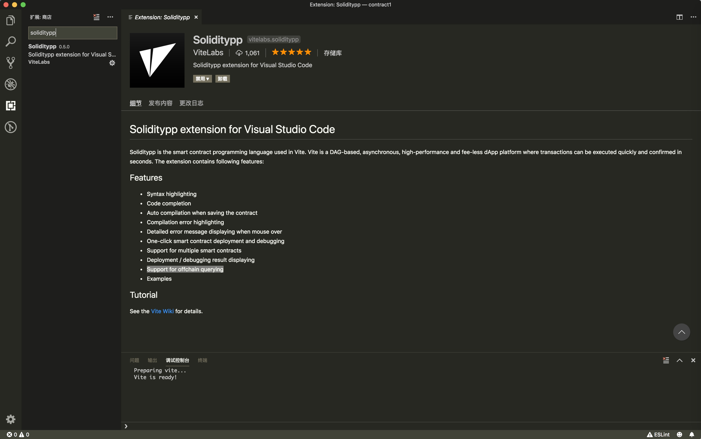
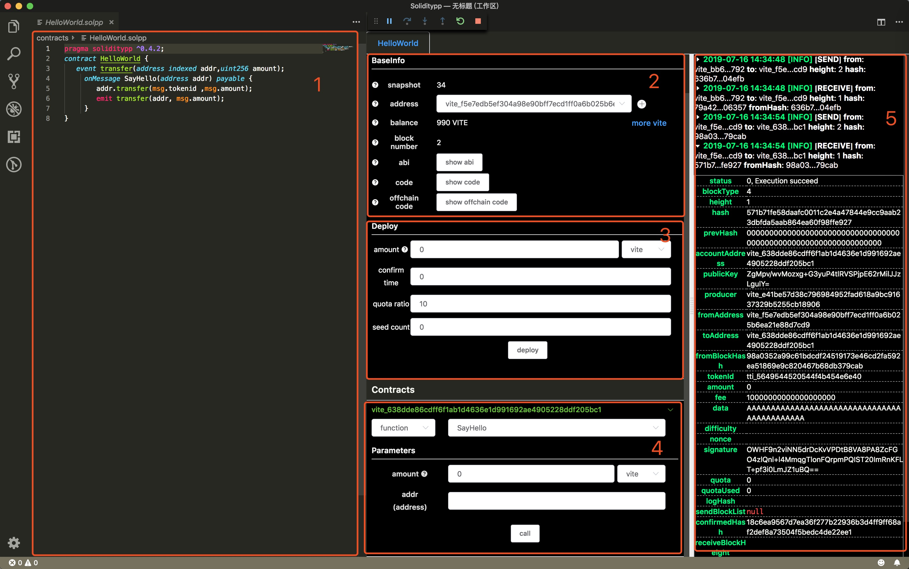

# Contract Debugging

## Debugging Environment

In order to debug smart contract, you need setup a local node and do debugging through your node's RPC interface.

Vite provides 2 debugging environments: development and testing. 

**Development Environment**
* Account balance is NOT verified before sending transaction. 
* Each transaction can utilize maximum 47.62`UT` quota with no staking. 

**Testing Environment**
* Quota and balance are verified normally. Pay attention to your balance and quota during debugging.

::: tip Tips
It is possible to debug your smart contract in Microsoft Visual Studio Code (aka VS Code) in development environment.
:::
## Debug Contracts in VS Code

Soliditypp extension for VS Code supports debugging `solidity++` smart contract in local development environment.

Following features are supported:

* `solidity++` syntax highlighting
* `solidity++` code auto completion
* Auto compilation when saving `.solpp` file
* Compilation error highlighting
* Detailed error message displaying when mouse over 
* One-click smart contract deployment and debugging
* Support for multiple smart contract interaction
* Deployment/debugging result displaying
* Support for offchain queries
* Example `solidity++` code

### Install Soliditypp Extension

Search for "soliditypp" in VS Code and install.

<!--  -->

### Generate examples

Open VS Code workbench, press `⇧⌘P`(or `F1`) in Mac(or `Ctrl+Shift+P` in Windows) to bring Command Palette, and then execute command `soliditypp: Generate Examples`. This will generate example contracts in the working directory.

### Write Smart Contract

Write your contract in a new `.solpp` file and then save it by pressing `⌘S` in Mac(or `Ctrl+S` in Windows). Your source file will be automatically compiled each time it is saved. 
Lines with compilation error in the code will be marked with red underscore. Detailed error message will be displayed when you mouse over.

VS Code will recognize `.solpp` file as `solidity++` source by default. 

### Deploy/Debug Smart Contract

In Debug panel, start debugging and choose `Soliditypp` environment. This will launch a local `gvite` node and all following deployment and debugging steps will take place on this node.
Please note that all data will be cleared from the node after debugging is complete.

<!-- 

* Section 1: soliditypp source code panel
* Section 2: current address used for contract deployment and debugging. If you want to use a different address, click `+` to generate a new address and then choose the address in the droplist on the right side
* Section 3: deploy panel. Field `amount` can be used to send VITE (1 VITE = 1e18 attov) upon deploying the contract. Click `deploy` button to deploy the contract in local development environment.
* Section 4: contracts deployed. Multiple results will be displayed if more than one contracts are deployed. Parameter `amount` is used to send VITE to the contract when calling a function. For example, clicking `call "SayHello"` will call method `SayHello` of contract `HelloWorld`
* Section 5: deployment/debugging result. `Send`/`Receive` shows the information of request/response transaction. New request transaction is displayed in `Receive` if it calls other method. Please note that transactions in Vite are asynchronous and user may need wait until the response transaction is generated after sending the request. More information about `Send` and `Receive` please see [AccountBlock](../../api/rpc/common_models_v2.html#accountblock)。 -->

## Debug Contracts in CLI
 
### Create A Boilerplate
Clone the examples project from: https://github.com/vitelabs/soliditypp-examples as a boilerplate.

```bash
git clone https://github.com/vitelabs/soliditypp-examples.git
```

### Quick Start
```
npm install
npm test
```
### Test on Release Environment
Contracts are compiled by the release version of solppc and deployed on local network running the release version of gvite.
```
npm run test-on-release
```

### Test on Beta Environment
Contracts are compiled by the beta version of solppc and deployed on local network running the beta version of gvite.

Beta version means gvite is deployed on testnet but not deployed on mainnet yet.
```
npm run test-on-beta
```

### Test on Nightly Environment
Contracts are compiled by the nightly version of solppc and deployed on local network running the nightly version of gvite.

Nightly version is the developing build of solppc and gvite.
```
npm run test-on-nightly
```
### Create Your Own Contract

Create a `.solpp` file in `contracts` directory and write contract code in it.

Create a `.spec.ts` file in `test` directory and write tests in it.

### Compile Contracts
Use solppc-js to compile contracts: https://github.com/vitelabs/solppc-js.

