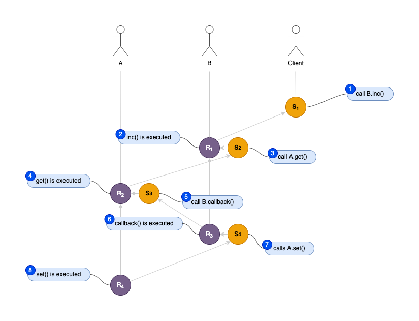
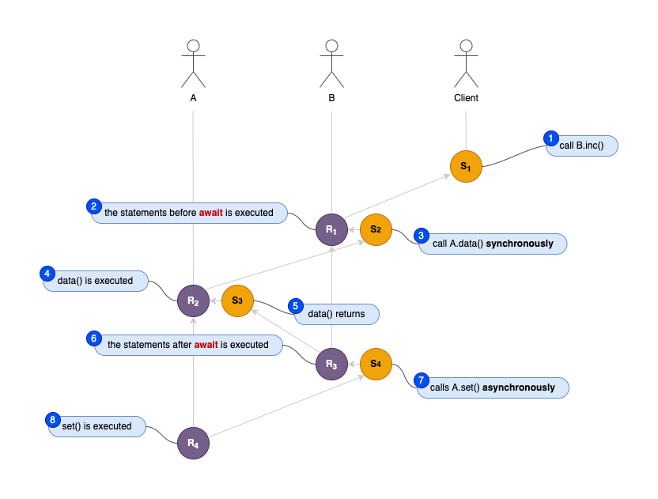

# Solidity++ 0.8

The design goal of Solidity++ 0.8 is to be compatible with the syntax of Solidity as much as possible, so that developers don’t have to learn different languages to implement the same thing.

We assume that you are already familiar with Solidity, if not, please read [Solidity documentation](https://docs.soliditylang.org/) before starting.

::: tip Notice
The Solidity++ 0.8 is still under development, you can try a nightly build version for development or test, but do **NOT** deploy contracts to the mainnet until a stable version is released. Please report an issue [here](https://github.com/vitelabs/soliditypp/issues) if you find a bug.
:::

## Get Started
Let us begin with a basic example that sets the value of a variable and exposes it for frontend to access. 

```javascript
// SPDX-License-Identifier: GPL-3.0
pragma soliditypp >=0.8.0 <0.9.0;

contract SimpleStorage {
    uint storedData;

    function set(uint x) external {
        storedData = x;
    }

    function get() external view returns (uint) {
        return storedData;
    }
}
```

As above, the way of declaring a contract is syntactically similar to Solidity.

The first line tells you that the source code is licensed under the GPL version 3.0.

The next line specifies that the source code is written for Solidity++ version 0.8.0, or a newer version of the language up to, but not including version 0.9.0. This is to ensure that the contract is not compilable with a new (breaking) compiler version, where it could behave differently.
The only difference with Solidity is to replace `solidity` with `soliditypp`.

There are two interface functions in the **SimpleStorage** contract. The syntax of function declarations is the same as Solidity, but the semantics are different. 

An interface function of a Vite contract is an *async function*.

::: tip Notice
An *async function* does not execute or return result in the request transaction but in a subsequent response transaction.
:::

## Asynchronous Functions
Unlike those Ethereum forks, Vite is a completely different blockchain with an asynchronous VM. All *message calls* on Vite are fully asynchronous.

An asynchronous call is not blocked when waiting for the called function to return. The caller cannot get the return data immediately after the call. Instead, it gets a *promise* of return types. (The promise syntax is not implemented in the current version.)

## Callbacks

In 0.8.0, you can declare callback functions to pass return data back to the caller as follows:

```javascript
// SPDX-License-Identifier: GPL-3.0
pragma soliditypp ^0.8.0;

interface Listener {
    function callback(uint result) external;
}

contract A {
    uint public data;

    function get() external {
        Listener sender = Listener(msg.sender);
        // Call callback function explicitly to return data to the caller.
        sender.callback(data);
    }

    function set(uint a) external {
        data = a;
    }
}

contract B is Listener {
    A contractA;

    constructor (address addr) {
        contractA = A(addr);
    }

    function inc() external {
        // Call Contract A asynchronously.
        contractA.get();
        // Contract A will NOT return data immediately.
    }

    // This function is only for receiving return data of Contract A, DO NOT call it explicitly.
    function callback(uint result) external override {
        // Contract A will return data by invoking this callback function.
        contractA.set(result + 1);
    }
}
```

After A and B are deployed, a client can invoke `B.inc()` function to increment `A.data`.

The execution is NOT in a single transaction, instead, there are multiple transactions initiated and propagated on Vite blockchain.



* When the client invokes `B.inc()`, a request transaction *S1(C->B)* (from the client to B) is initiated.
* Vite is listening all open request transactions to the address of contract B. Once *S1* is discovered, Vite VM is activated and the code of `B.inc()` is executed. A response transaction *R1(S1)* (linked to *S1*) will be initiated after the execution.
* When the `contractA.get()` statement is executed, a new request transaction *S2(B->A)* (from B to A) is triggered and merged to *R1*. ([VEP-7: Merge In-Contract Request Calls into Original Response as one Transaction](https://docs.vite.org/go-vite/vep/vep-7.html))
* When *S2* is accepted by contract A, the code of `A.get()` is executed and a response transaction *R2(S2)* (linked to *S2*) will be initiated after the execution.
* When the `sender.callback(data)` statement is executed, a new request transaction *S3(A->B)* (from A to B) is triggered to send the result back to B. (*S3* will be merged to *R2*).
* When *S3* is accepted by contract B, the code of `B.callback()` is executed. A can get the latest value of `B.data` from the parameter `result` of the function `callback`. After the execution, a response transaction *R3(S3)* (linked to *S3*) will be initiated.
* When the `contractA.set(result + 1)` statement is executed, a new request transaction *S4(B->A)* (from B to A) is triggered. The data field of *S4* is composed of a 4-bytes function selector of `A.set()` and an argument with value of `result + 1` which is encoded in ABI format.  (*S4* will be merged to *R3*).
* When *S4* is accepted by contract A, the code of `A.set()` is executed. The value of storage variable `data` is set to the new value from the calldata of *S4*. After the execution, a response transaction *R4(S4)* (linked to *S4*) will be initiated. 

## Await Expressions

In 0.8.1, `await` operator is introduced. The `await` is used to wait for an asynchronous function to return.

The following code shows the usage of `await`:

```javascript
// SPDX-License-Identifier: GPL-3.0
pragma soliditypp ^0.8.1;

contract A {
    uint public data;

    function set(uint a) external {
        data = a;
    }
}

contract B {
    A contractA;

    constructor (address addr) {
        contractA = A(addr);
    }

    function inc() external {
        uint result = await contractA.data();
        contractA.set(result + 1);
    }
}
```
It's not required to declare callbacks explicitly in 0.8.1, the solppc compiler will generate callbacks for each await expression under the hood.



* When the client invokes `B.inc()`, a request transaction *S1(C->B)* is initiated.
* Once *S1* is dicovered and accepted, the code of `B.inc()` is executed. 
* When the `await contractA.data()` expression is executed, a new request transaction *S2(B->A)* is triggered. The VM will halt immediately after executing the `await` expression and a response transaction *R1(S1)* will be initiated. (*S2* and *R1* are melt into one transaction.) 
* When *S2* is accepted by contract A, the code of `A.data()` is executed. This getter function is generated automatically by the compiler. 
There is no explicit callback invocation in `A.data()`. Vite VM can infer that the call is synchronous and need a callback. It will initiate a new request transaction *S3(A->B)* when the function returns. In addition, a response transaction *R2(S2)* will be also initiated. (*S3* and *R2* are melt into one transaction.) 
* When *S3* is accepted by contract B, a compiler-generated callback is executed. Vite VM will unpack the arguments from the *calldata* of *S3*, then jump into the code after the await expression. At this point, the latest value of `A.data` is ready for the following assignment statement, and the rest of the code will be executed subsequently. When the `contractA.set(result + 1)` statement is executed, a new request transaction *S4(B->A)* is triggered. The data field of *S4* is composed of a 4-bytes function selector of `A.set()` and an argument with value of `result + 1` which is encoded in ABI format. Then the `B.inc()` function ends, a response transaction *R3(S3)* will be initiated. (*S4* and *R3* are melt into one transaction.) 
* When *S4* is accepted by contract A, the code of `A.set()` is executed. The value of storage variable `data` is set to the new value from the calldata of *S4*. After the execution, a response transaction *R4(S4)* will be initiated. 

According to the above description, the code in 0.8.1 has a different syntax but the same semantics as the code in 0.8.0. The compiler and VM do a lot of mechanical work for the developer under the hood.

::: tip Notice
The `await` operator is only available after a Vite mainnet upgrade to enable the required instructions.
:::

::: tip Important
A function in Solidity++ not equivalents to a tranction on Vite, so functions are not guaranteed to have ACID semantics. The example above demonstrates a potential *Isolation Failure* issue which is known as *Lost Update Problem*. 
Consider the situation that `B.inc()` is invoked by two simultaneous requests, the corresponding responses both read `A.data` and then update it, the effects of the first update will be overwritten by the second update. In other words, after two function calls, `A.data` may have only increased by 1.
:::

## Contribution

The Solidity++ is open sourced [here](https://github.com/vitelabs/soliditypp). 

We welcome contributions from anyone interested, including reporting issues, fixing bus, commit new features and improving or translating the documentations.