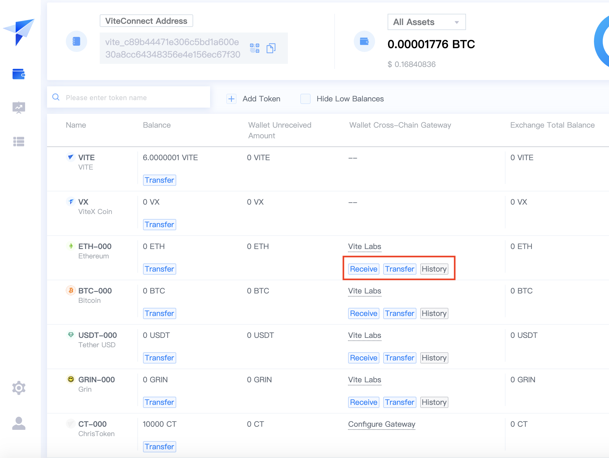

# ViteX Gateway Integration Guide

## What is ViteX Gateway

ViteX Gateways provide a way to transfer digital assets between any blockchain (Source Chain) and those on the Vite blockchain (Gateway Token).

For instance, if a user wants to trade BTC on the ViteX exchange, she will first convert BTC on the Bitcoin blockchain ("native BTC") into a BTC-backed token on the Vite blockchain ("BTC-000"). A user holding an amount of BTC-000 also can convert these tokens back to native BTC via the ViteX Gateway. Between the two said conversions, the native BTC are locked inside the ViteX Gateway.

Following the [ViteX Gateway Protocol](./gateway-protocol.md), anyone can setup a ViteX Gateway without permissions. The ViteX web app and mobile app already support the protocol. The only thing to run a third-party ViteX Gateway is implementing interfaces defined in this protocol.

## How to Create a ViteX Gateway
### Pre-requisites

* Forge a new token on Vite chain to represent the digital asset in the Source Chain. See [here](./../../tutorial/rule/mintage.html) for instructions of token forging. The new token should have the same total issuance amount and decimal places as the Source Chain asset.
* The operator must be able to verify and send transactions for Gateway Token. To do so, she can either run a Vite full node or use API from full nodes from Vite team. 
> * Instructions for how to run a Vite full node are [here](./../../tutorial/node/install.html). 
> * Instructions for sending and inquiring about Vite transactions are [here](./../../api/rpc/).
* The operator must be able to verify and send transactions for Source Chain token as well. Similarly to the above bullet point, she can run a full node for the Source Chain, or use API provided by trustworthy full nodes on the Source Chain.

### How to Integrate

* The developer would need to use a testing environment. ([https://x-test.vite.net/assets](https://x-test.vite.net/assets)).
* Forge the coin in the testing environment. In the below screenshot, we assume ETH-0 as the token forged.

* 
* 

## Tips for Properly Operating a Gateway
### Asset Custody

* Private keys should be stored in cold wallets
* Strategy for managing hot wallets (Holding period of assets, upper limit for amount of assets in custody)
* Management of private keys (components of secrets shared across multiple people and stored in multiple locations)
* Distribution of assets amongst multiple locations ("Don't put all your eggs in one basket")
* Real-time reconciliation

### Deposits and Withdraws

* Wait for reasonable number of confirmations prior to transfers
* Temporary halt of deposit/withdrawal functions during forks

### Monitoring

* Pay attention to users who withdraw for the first time, and addresses used for withdrawal for the first time
* Regularly check-in on internal monitoring process
* Frequent and timely analyses of transfer data
* Monitoring and confirmation for large deposits and withdrawals

### Throttling

## Example

The following illustrates the workflow of an Ethereum Gateway.

### Gateway Addresses

The Gateway needs to maintain the following types of addresses:

1. Cold wallet addresses, including ETH addresses and VITE addresses. Large amounts of assets should be stored in the cold wallet to ensure asset safety.
2. Hot wallet addresses, including ETH addresses and VITE addresses. They are used to accommodate daily transfers.
3. One ETH address for each VITE address, to facilitate deposits into the Gateway.
4. User's own ETH address and VITE address.

### Business Workflow
#### Cross-Chain Deposits

1. Assignment of user addresses. When a user initiates a cross-chain deposit, the Gateway assigns an ETH address dedicated to this user's deposit process. This address is shared with the user, and its private key is kept by the Gateway.
2. Monitor the said ETH address and wait for a proper number of confirmations.
3. Once the Gateway determines this ETH transaction as confirmed, transfer the appropriate amount of Gateway Tokens to the user's VITE address. If need be, transfer the Ether in said ETH address into the hot wallet.
4. Monitor the VITE network and confirm this Gateway Token transaction. Update records for cross-chain deposits.

#### Cross-Chain Withdraws

1. The user provides an address for the withdraw and submits the withdraw request. At this point, the official web wallet will sign (on an offline basis) and send a VITE transaction (of the Gateway Token) from the user's VITE address to the Gateway's VITE hot wallet. The transaction will take into account the withdraw amount and transaction fees.
2. The Gateway monitors for confirmations and waits until sufficient confirmations have taken place.
3. Once the Gateway deems this transaction as confirmed, it transfers the appropriate amount of Ether from the ETH hot wallet into the user's ETH address
4. Monitor the ETH network and update records for cross-chain withdraws once the transaction has been deemed confirmed.

#### Transfer of Funds involving Cold Wallet

Allocate 20% of the funds in the hot wallet, and 80% in the cold wallet. The allocation decision will be driven by total token balance and the nature of the flow of funds through the Gateway.

