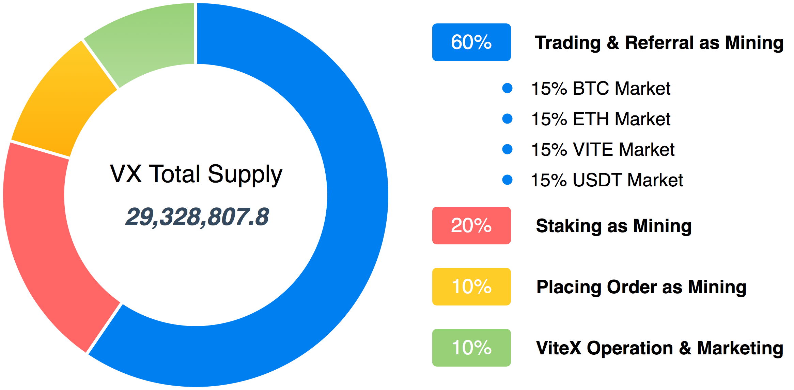
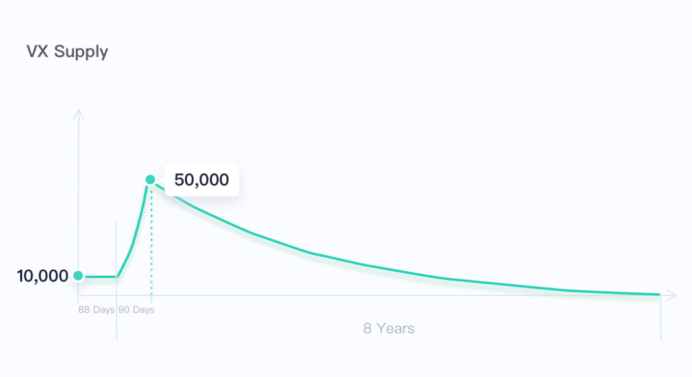

# One Page

:::tip ViteX
A fully decentralized exchange built on the Vite blockchain. The world's first DAG-based decentralized exchange. 

**ViteX is of the community, by the community, for the community.**
:::

* **Features**:
  * Eligible to daily dividends. 100% fee income of ViteX are distributed to VX holders.
  * Eligible to ViteX's governance by voting.
* **Total supply (Never Inflated)**: ***29,328,807.8*** 
* **Distribution**：There was no private or public sale. Mining is the only source of VX, which can be done in the following ways:
  * **Trading**: Whenever a trader takes an order off the order book, they get VX.
  * **Staking**: By staking VITE for the benefit of ViteX for minimum **3 days** （7 days locking required upon retrieval）, users receive VX as a reward. 
  * **Referring a friend**: For every friend that you bring to trade on ViteX, they enjoy **10%** discount on trading fee and both of you are rewarded with VX
  * **Market-making**: Place orders to boost liquidity on ViteX and get rewarded with VX. 
  * **Listing a trading pair**: A user that lists a new trading pair receives VX. 

 
  
**Release schedule**：***29,328,807.8*** VX will be released over the course of **8 years** as follows:
  
 

