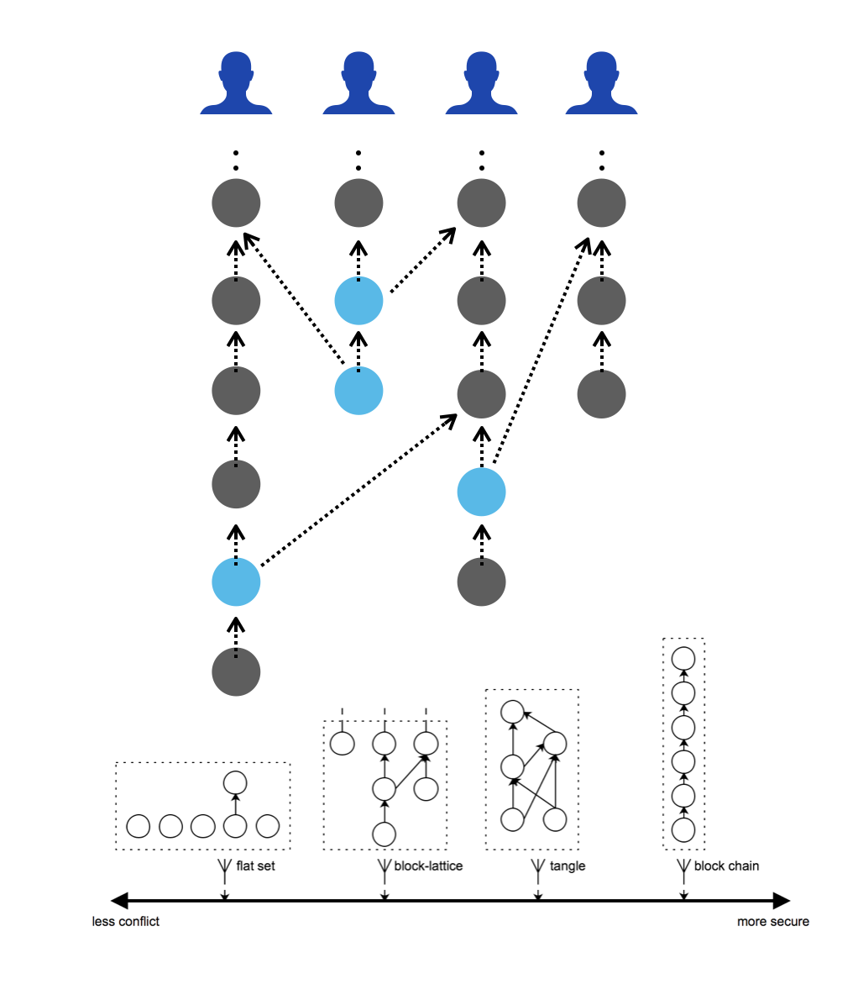

# DAG Ledger

::: tip
This document is only for introduction. if you need more detail on vite, please move to [White Paper](https://github.com/vitelabs/whitepaper/blob/master/vite_en.pdf)
:::

Vite makes use of a DAG ledger structure called block-lattice. Each account has its own chain. Each transaction refers to the hash of the previous transaction in the same account. Transactions are divided into two types: "request transactions" and "response transactions.”  A response transaction needs to refer to the hash of the corresponding request transaction. This setup creates a grid-like DAG structure. 

Such a structure allows parallel writing of individual transactions, reducing the probability of collisions and improving system throughput.

Note that this structure has an inherent deficiency in security.   This is because transactions are grouped by accounts, and each transaction is only attached to the chain associated with the relevant account. Transactions generated by other accounts do not automatically become the subsequent nodes of the previous transaction. Therefore, for some transactions, the rollback probability of their reversion will not drop over time.  To address this issue, Vite makes use of the snapshot chain technology.
