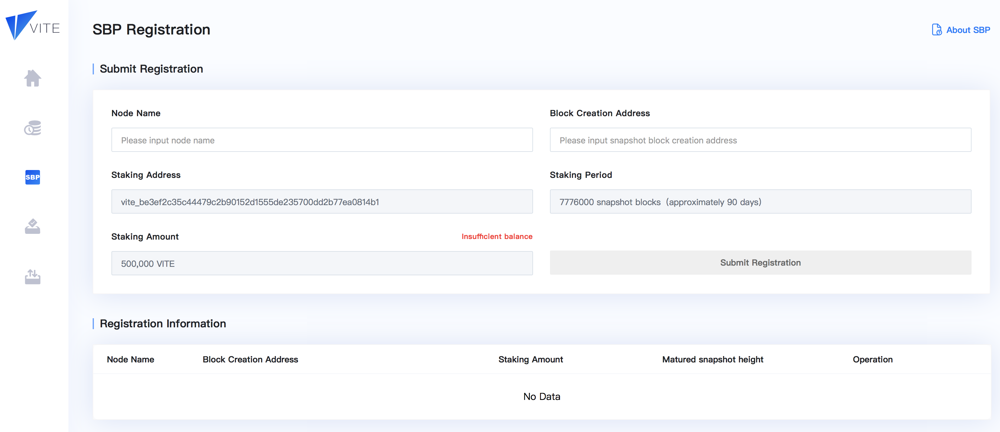

# SBP Node

:::tip
This document mainly introduces how to config supernode and SBP registration.
Before reading this article, please see [Node - Installation](./install.md) to install gvite first.

* **Vite Mining Rules**: [Rules - SBP](../rule/sbp.md)
* **Full Node Installation Tutorial**: [Node - Installation](./install.md)
* **Wallet Management**: [Node - Wallet Management](./wallet-manage.md)
:::

## SBP Configuration
In order to set up a supernode, first you need install a full node and then enable mining related properties.

### Create Wallet

See [wallet Management](./wallet-manage.md).

### Edit node_config.json

Append 4 properties in **node_config.json**

* Set `Miner` as `true`
* Set `CoinBase` in format of `index:address`. For example: `0:vite_f1c2d944b1e5b8cbfcd5f90f94a0e877beafeced1f331d9acf`.
* Set `EntropyStorePath` as your mining address. For example: `vite_f1c2d944b1e5b8cbfcd5f90f94a0e877beafeced1f331d9acf`.
* Set `EntropyStorePassword` as your keystore password corresponding to above address.

**Below is a complete example**

```json
{
  "Identity": "vite-node",
  "NetID": 1,
  "ListenInterface": "0.0.0.0",
  "Port": 8483,
  "FilePort": 8484,
  "MaxPeers": 10,
  "MinPeers": 5,
  "MaxInboundRatio": 2,
  "MaxPendingPeers": 5,
  "BootSeeds": [
    "https://bootnodes.vite.net/bootmainnet.json"
  ],
  "Discover": true,
  "RPCEnabled": true,
  "HttpHost": "0.0.0.0",
  "HttpPort": 48132,
  "WSEnabled": false,
  "WSHost": "0.0.0.0",
  "WSPort": 41420,
  "HttpVirtualHosts": [],
  "IPCEnabled": true,
  "PublicModules": [
    "ledger",
    "public_onroad",
    "net",
    "contract",
    "pledge",
    "register",
    "vote",
    "mintage",
    "consensusGroup",
    "tx",
    "debug",
    "sbpstats",
    "dashboard"
  ],
	"Miner": true,
	"CoinBase": "0:vite_d2fef1e5ffa7d9139bd7c80a672e0530789bac6c7c9ff58dc6",
	"EntropyStorePath": "vite_d2fef1e5ffa7d9139bd7c80a672e0530789bac6c7c9ff58dc6",
	"EntropyStorePassword": "123456",
  "LogLevel": "info"
}
```
### Reboot Node

Execute the following command
```bash tab: Input
ps -ef|grep gvite
```
to obtain existing gvite process id

```bash
ubuntu   27268     1 99 16:00 ?        01:54:56 ./gvite -pprof 
```

Kill it

```bash
kill -9 27268
```

Then reboot

```bash
./bootstrap
```

Run 
```bash
ps -ef|grep gvite
``` 
to check if gvite is rebooted successfully

## SBP Registration

:::tip
Registering new SBP requires staking 1,000,000 VITE. Please ensure you have the amount in your account.
:::

Log in [Vite Web Wallet](https://wallet.vite.net/) and navigate to **SBP Registration** page.

Fill in **Node Name** and **Block Creation Address**. 

Please note that **Block Creation Address** is the address you configured on node server and is only responsible for producing new blocks. Do NOT use your **Staking Address** as **Block Creation Address**.



### SBP Name

Give your SBP a nice name. Bad name will not help recognition or attracting votes. SBP name cannot be changed once registration is done.

### SBP Ranking List

Visit [https://explorer.vite.net/SBPList](https://explorer.vite.net/SBPList) for the ranking list.


