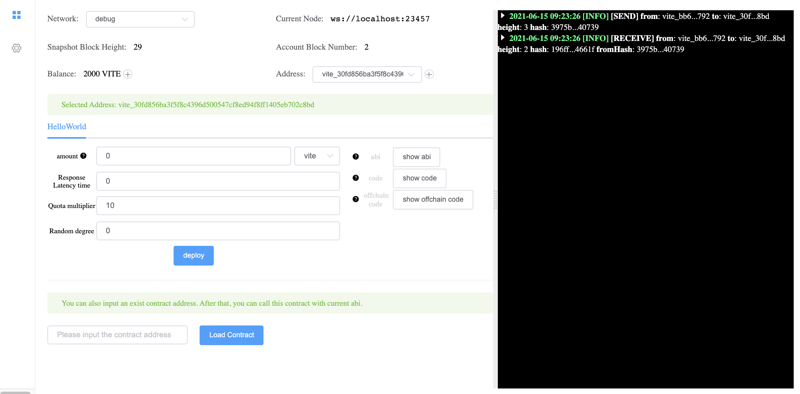
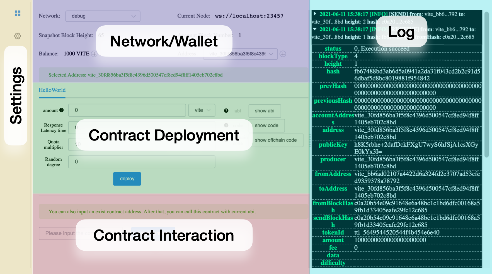
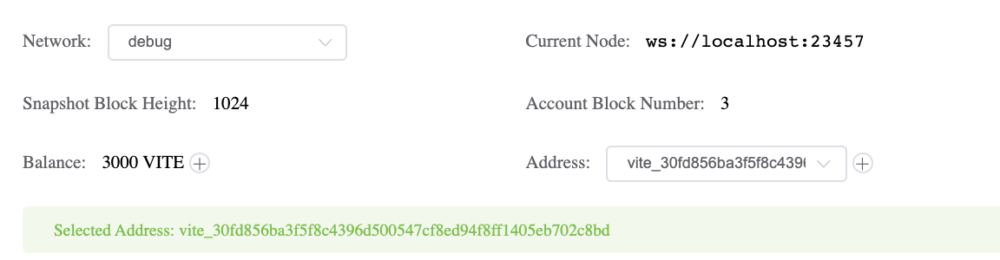
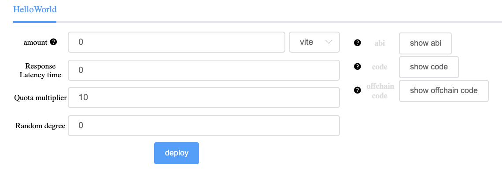
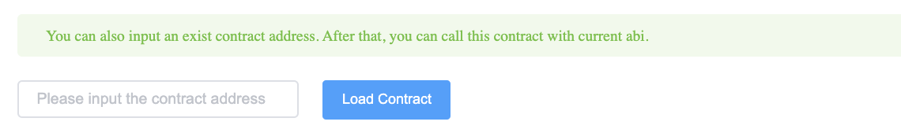
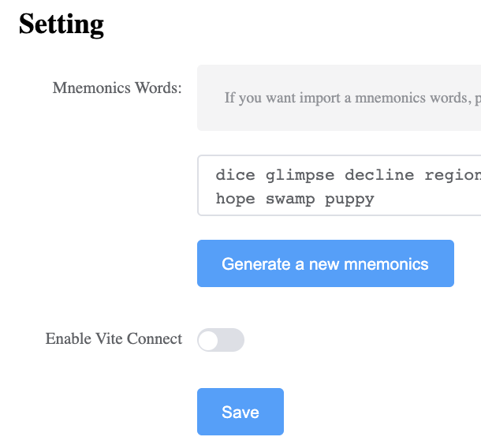

# Using the Debugger

Before reading this page, you should have already followed the [installation guide](../introduction/installation/) and successfully [deployed your first contract](../introduction/installation.html#deploying-your-first-contract) to the local debug network. This page will cover the features of the debugging interface in more detail.

 

 Debugger interface

   

## Starting / Stopping

**Starting:** From within VSCode, press `F5` to launch the debugger for the current Solidity++ file. This will compile your file and open a web browser with the debugging interface. In the background, a local `gvite` node is started; all deployments and interactions on the "debug" network are on this local node.

**Stopping:** From within VSCode, press `Shift+F5` to stop the debugger.
Please note that all data will be cleared from the local debug node after stopping the debugger.

## Layout

The debugger interface is split into several sections as shown below.
 

 Debugger Layout

 
- [Network/Wallet](#network-wallet)
- [Contract Deployment](#contract-deployment)
- [Contract Loading](#contract-loading)
- [Contract Interaction](#contract-interaction)
- [Log](#log)
- [Settings](#settings)

## Network/Wallet

 

 Network/Wallet

   

- **Network**: choose from `debug`, `testnet` and `mainnet`.

- **Current Node**: Shows the websocket address of the current node, reflects the current network.

- **Snapshot Block Height**: For the `debug` network, this starts at a height of 1 and increases once per second as snapshots are produced by the local node. For the `testnet`/`mainnet` this shows the current Snapshot Block Height.

- **Account Block Number**: Shows the currently selected address' account block height. Each `Send` and `Receive` transaction adds one additional block.

- **Balance**: Shows the Balance of the current address. On the `debug` network you are automatically provided 1000 Vite. Testnet Vite can be [requested from a faucet](../tutorials/dev-wallet.html#personal-wallet-setup), while mainnet Vite must be acquired through an exchange.

- **Address/Selected Address**: Current address used for contract deployment and debugging. If you want to use a different address, click `+` to generate a new address and then choose the new address in the drop-down list.

## Contract Deployment

 

 Contract Deployment

   

- **Contract Selection**: If multiple contracts are in a single `.solpp` file, they will be displayed at the top and can be selected (only the contract `HelloWorld` is shown in this image).

- **amount**: Amount of Vite to send to the contract's constructor upon deployment.
::: warning
If deploying a contract with `amount>0`, the contract constructor ***must*** be `payable` or the contract will not deploy successfully .
:::

- **Response Latency Time**: 
This parameter specifies the required confirmation depth (i.e. number of snapshot blocks) on any request transaction before the deployed contract will send a response transaction. This value ranges from 0 to 75, where 0 means there is no waiting period and respond block will be produced immediately. 
If a contract uses timestamps, snapshot block height, or random numbers, then this value ***must*** be greater than zero. Generally speaking, larger response latency means slower contract response, and the response transaction will consume more quota.

- **Quota multiplier**: This parameter modifies the amount of quota consumed by all transactions that call the contract. Quota charged on the contract's response transactions are not affected. The Quota multiplier has a range from 10 to 100, which corresponds to a range of 1x to 10x quota consumption. For example, a value of 15 means that the requested transaction to the contract uses 1.5x the default rate.

- **Random degree**: The number of snapshot blocks having random seed by which request sent to this contract is confirmed before responding to the specific transaction. Value range is 0-75. 0 indicates that there is no waiting for the request transaction to be included in a snapshot block that contains random number. If any random number related instruction is used in the contract, the value must be above 0. In general, the larger the value, the more secure the random number. This parameter must be no greater than response latency.

- **show abi**: Shows the contract's abi, specified in json. It is important to have this information to design interfaces for any deployed contract.

- **show code**: Shows the contract's compiled code.

- **show offchain code**: Shows the contract's compiled offchain code. It is important to have this information to design interfaces for any deployed contract.

* Section 3: deploy panel. Field `amount` can be used to send VITE (1 VITE = 1e18 attov) upon deploying the contract. Click `deploy` button to deploy the contract in local development environment.

## Contract Loading

 

 Load a Contract

   

This menu only appears before a contract has been loaded or deployed. You can use this menu to load a contract currently deployed on the `testnet` or `mainnet`.

Note that the currently selected contract in the deployment menu must have the correct abi for the contract you are attempting to load, otherwise the contract interaction interface will not have the correct functions or parameters available.

## Contract Interaction

 

 Contract Interaction

   

This menu only appears after a contract has been deployed or loaded, and is used to call functions on a given contract.

- **Contract Name/Address**: If using the debugger to deploy contracts, it is important to save the address of deployed contracts.

- **function type**: In the function type drop down, you can select `function` or `offchain`. All `function`s correspond to message listeners, while `offchain`s correspond to getters.

- **Parameters**: This interface is automatically generated based on the compiled contract.

## Log

 

 Log

   

* The log shows details for for any `Send` or `Receive` transactions added to the current account. Contract response transactions are also be logged. Each transaction can be expended for additional details, for definitions see [account block details](https://docs.vite.org/go-vite/api/rpc/common_models_v2.html#accountblock).

## Settings

 

 Settings Menu

   

- **Mnemonic Words**: These words are used to generate the private keys and associated wallet addresses used in the debug environment.
::: danger
Keep your mnemonic words **secret**. Do not fund accounts used for debugging with significant amounts of Vite or other tokens. Be aware that any keys stored on a computer are high risk.
:::

- **Vite Connect**: Instead of using mnemonic words, this option allows the use of Vite Connect to use a wallet secured by your Vite wallet app.

::: tip
Vite Connect is a safer approach since your wallet's keys are not sent to the computer. All transactions must be confirmed and signed via the Vite Wallet app. Note that even if you decide to use Vite Connect, it is still recommended to have a dedicated developer wallet that stores only the funds needed for deployment (10 Vite per contract deployment).
:::

