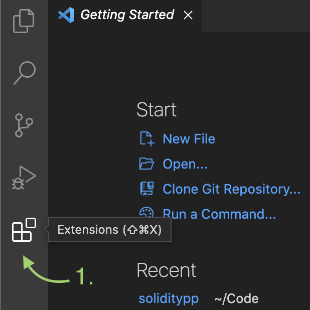
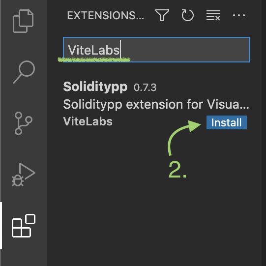
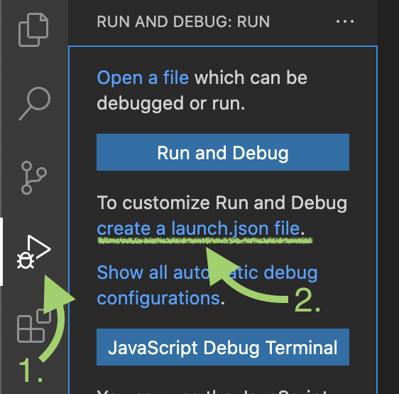
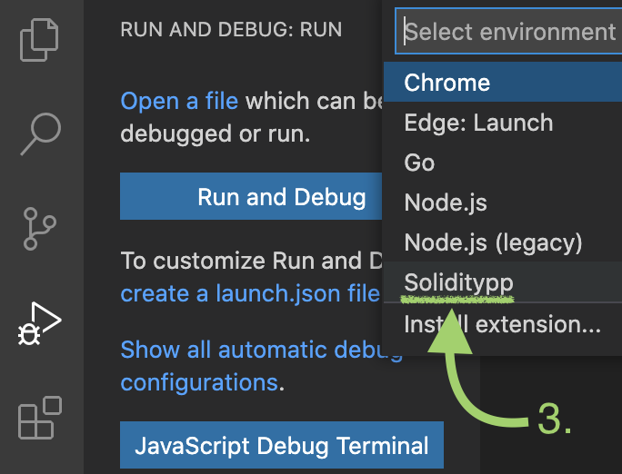
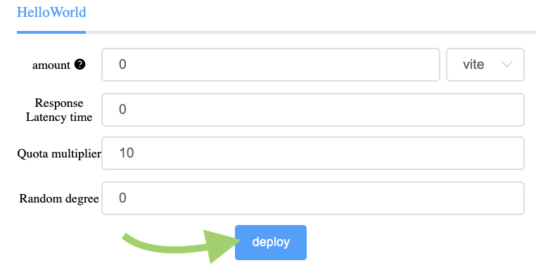
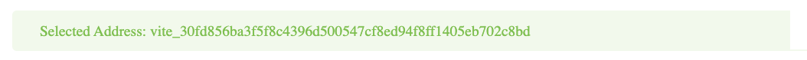
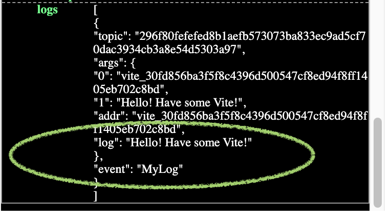

# Installation
The recommended development environment for Solidity++ is **Visual Studio Code**, for which ViteLabs has developed the **Soliditypp** extension containing a ready-to-go compiler and debugging environment. Follow the [instructions](#installing-the-visual-studio-code-extension) below for installing and testing.<!--, or if you prefer, there is a [video guide]() for setting up the environment.-->

::: tip Manual Compiler Installation:
Instructions for installation *without* VSCode [here](https://docs.vite.org/go-vite/contract/debug.html#debugging-in-command-line).  **(not recommended for most users)**
:::

## Installing the Visual Studio Code Extension

1. Download and install [Visual Studio Code](https://code.visualstudio.com/).

2. Within VSCode, navigate to the **Extensions** panel and search for "ViteLabs" and install the **Soliditypp** extension.

 Open extensions panel.

 Install Soliditypp extension.

   

That's it! Now you can proceed to test your environment by [deploying a contract](#deploying-your-first-contract).

## Deploying your first contract

1. Within VSCode, **open a new folder** for your Solidity++ projects.

2. Open the debug panel, and click the **"create a launch.json file"** link. Then choose **"Soliditypp"** for the environment.

 

 Create a launch.json file.

 Choose "Soliditypp" enviornment.

   

This automatically generates a `launch.json` file which is used by VSCode to configure the debugger. You'll need to create this file for each of your Solidity++ project folders.

3. Create a new file called `HelloWorld.solpp` and paste the following code below:

<<< @/tutorial/sppguide/basics/simple-contracts/snippets/helloworld.solidity

 This HelloWorld contract redirects funds sent to the contract's `sayHello` function, while emitting a logging event. [We will cover this contract in depth later](../basics/simple-contracts/hello-world/), but for now let's compile and deploy it.

::: tip
You can automatically generate a `HelloWorld.solpp` contract by using the Soliditypp VSCode extension. Simply press `⇧⌘P` (Mac) or `Ctrl+Shift+P` (Windows) to open the Command Palette, and execute the command `>soliditypp: Generate HelloWorld.solpp`. This will create the `HelloWorld.solpp` in the current folder.
:::

4. Launch the debugger by pressing `F5`. This automatically saves and compiles the source, and a browser window should pop up with the debugger interface shown below. This will take more time the first launch, but when the interface appears you're ready to deploy your first contract!

 

 Debugger interface.

   

::: warning Compiler Errors
If the debugger interface doesn't launch, check the debug console and fix any errors:

:::

5. To deploy your contract on to the local debug node, simply press **Deploy** as shown below. There are several options available, but use the default values for now (later we will cover the [other options available in the debug interface](../basics/debugger/)).

 

 Deploy the contract.

   

6. When the contract is successfully deployed, a contract interface will appear, shown below, which we can use to call our contract. The function `sayHello` requires an address `dest` as an argument, so for testing let's copy our *own* address, which we can copy from the "Selected Address:" box.

 

 Call the contract function "sayHello".

   

7. After calling the contract, a new log entry should appear on the right. Click on the most recent log entry to expand it, and scroll to the bottom. You should see the VMLog entry as shown below:

 

 Successful VMlog output.

   

If so, congratulations, you've deployed and tested your first smart contract! 

::: tip Other things to try:
- You can also try sending some Vite to the `sayHello` function to see that funds are also transferred to the address you put in the `dest` parameter.
- Try creating additional addresses and use `sayHello` to send Vite back and forth.
:::

::: warning Common Issues:
- The cost to deploy a contract (10 Vite) is ***automatically*** deducted. Do not send Vite to the contract when deploying in step 5. As the contract does not have a *payable* constructor, the contract deployment will fail.

- The debug interface measures transactions in `attov`, the smallest unit of Vite. If the quantity of Vite transferred seems small, check the multiplier (`10^18 attov = 1 Vite`).

- The debug interface can take some time to load, as a full gvite client must first be downloaded. Check the VSCode debug log for the node status.
:::
