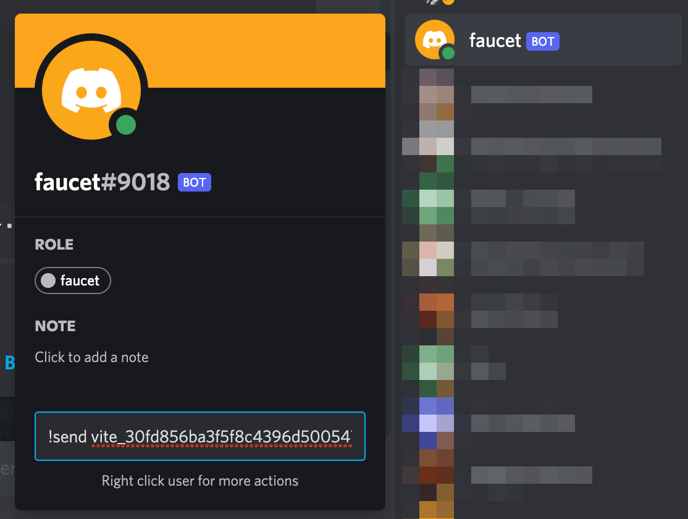

# Developer Wallet

To test smart contracts on either the testnet or the mainnet, you will need a Vite wallet that has enough Quota to deploy your contract and make contract contract calls. You will also need to supply your contract with Quota. This page describes an approach to funding your wallet and locking Vite for Quota, while keeping your personal funds and developer funds ***separate*** for better security.

The approach used in this page requires setting up two wallets:

#### 1. "Developer" Wallet
- Mnemonic phrase is generated by the debugger interface.
- Quota for the wallet should be provided by your personal wallet.
- **Wallet should only contain a minimal amount of Vite used to deploy contracts (around 10 Vite).**

#### 2. "Personal" Wallet
- Mnemonic phrase is generated by the Vite app on Android or iOS, or via a Ledger hardware wallet.
- Mnemonic phrase should never be input into a computer.
- Can safely lock Vite to provide Quota for your developer wallet and smart contracts.
- In general, it is safe practice to have a new wallet dedicated to testing.

## Wallet Setup

We will now walk you through setting up both wallets, as well as instructions for locking Vite to provide Quota.

### "Developer" Wallet Setup

1. Generate a Mnemonic phrase using the debugger.
2. Safely backup the phrase.
3. Record the address of the wallet.

::: warning
This is not a secure method for generating a Vite wallet. This is not an issue for use on the testnet, but do not store large amounts of mainnet Vite on this wallet.
:::

### "Personal" Wallet Setup

1. **(mainnet only)**
	- Create a wallet through the [Vite iOS or Android app](https://app.vite.net/).

2. **(testnet only)**
	- Web Wallet
		- You may be tempted to use an existing Vite wallet for this purpose. In general, it is safe practice to have a new wallet dedicated to testing. Obtain the seed phrase on this website: [generate mnemonic](https://iancoleman.io/bip39/).
		- Import the seed phrase (aka mnemonic) to access your Testnet wallet here: [Testnet wallet](https://buidl.vite.net/startLogin).
	- Vite iOS or Android app
		- In the Node Setting Page of the Android/iOS Vite app, set your network to `https://buidl.vite.net/gvite`

3. Get Vite:
    - **(testnet)**  
Go to the [Vite Discord](https://discordapp.com/invite/CsVY76q) and send a DM containing `!send vite_yourtestnetaddress` to the bot @faucet (see image). Your address will be provided with 10,000 Vite.
 

 Get testnet Vite through Discord.

   

 - **(mainnet)**  
Buy Vite from any of the exchanges [here](https://vite.org/token#getToken), and transfer to your address.

4. Now you can lock Vite for Quota using the web wallet.
    - **(testnet)**: [https://buidl.vite.net](https://buidl.vite.net)
	- **(mainnet)**: [https://x.vite.net](https://x.vite.net)

   You'll want to provide Quota for your Developer wallet, as well as any contracts you deploy. Since your funds are still stored in your personal wallet, and you can log into the web wallet through ViteConnect, this approach is safer.
