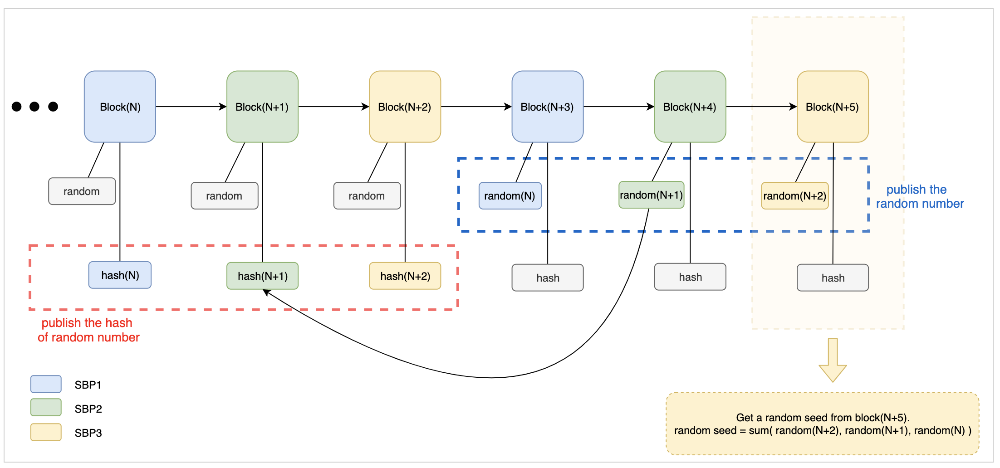

# VEP-12: The Implementation of Random Numbers in Vite

## Background

Random numbers are widely used in Vite. 
One good case is the consensus reaching process, where a random number is chosen in each round in the purpose of determining which supernode is responsible for producing the next snapshot block without being predicted in advance.
Another scenario is in gambling dApp games the results are generated depending on unpredictable random numbers to avoid manipulation.
In general, the random numbers in Vite should meet the following criteria:

1. Should NOT be manipulable
2. Should NOT be predictable

## Implementation

The design evolved from the dicing game in real life.
Basically, a simple dicing game will go through the following 3 steps:
1. The dealer shakes the dice box
2. The player guesses the numbers and makes bet
3. The dealer uncovers dice box and shows result

In this game, the dealer can have two ways of cheating:
1. Changing the result in secret after the player bets
2. Being aware of the result in advance and disguising as a player

In real life, the following methods can be used to prevent from dealer's cheating, but with no 100% guarantees.
1. Inspecting dicing instruments (including dice box and die)
2. Supervising the whole dicing process
3. Using the dealer's reputation as guarantee

In the blockchain world, a more secure and efficient way can be used to prevent the dealer from manipulating the result, by using random numbers. 
In effect, this is equivalent to the following steps in the dicing example:
1. Introduce multiple dealers and adding all dicing results up as the final result. As long as one dealer does not cheat, the overall result is unpredictable. This step greatly increases cheating cost and reduces the probability in return
2. Once the dicing result is generated, the result hash is calculated and shown in public before the player places a bet for verification purpose. Whenever the dicing result is announced, it should match the hash value published before. This step effectively prevents the result from being tampered with

Figure 1 shows how above idea is implemented in Vite

Figure 1

Each random number goes through three stages in the lifecycle:
1. $hash_N$ is announced when $random_N$ is generated
2. $random_N$ is announced
3. $random_N$ is used somewhere

In the figure, block $N$ to $N+5$ are 6 consecutive snapshot blocks produced by 3 SBPs (we assume the system has only 3 SBPs).

When producing a block, each SBP should announce the random number's hash of current round and the random number that was created by this very SBP in previous round. 
For example, $hash_{N+3}$ (the hash of random number in $Block_{N+3}$) and $random_N$ (the random number produced in $Block_{N}$) are announced in $Block_{N+3}$. This requires $Hash(random_N)=hash_N$, meaning the hash of $random_N$ should be in equal with $hash_N$, otherwise $random_N$ is invalid.

In this way, when a new block is produced, a random seed can be calculated based on the random numbers announced by all SBPs in previous round. In our example, $Block_{N+5}$ has random seed $Sum(random_{N+2}, random_{N+1}, random_{N})$.
This result is unpredictable until $Block_{N+5}$ is produced, and also $Block_{N+5}$ is not able to manipulate the result.
This perfectly satisfies the two criteria we mentioned above.

In actual implementation, in order to save storage, $random_N$ is defined as `uin64`, and $hash_N$ is `32byte`.

At the same time, for security reason of avoiding brute-force attack, the hash function is defined as:

$$hash_N = Hash(random_N, Block_N.PrevHash, Block_N.Timestamp)$$

## Random Seed in Contract

In Vite, a contract call is split into a pair of request and response. If random numbers are involved in the contract's business logic, the contract should wait until the request transaction is snapshotted and use this snapshot block for random seed. 
In real implementation, request block hash is used together to guarantee the maximum unpredictability.

## Conclusion

As the usage of random numbers in blockchain increases, a well-designed random number solution that cannot be manipulated and predicted significantly improves the security.
This proposal suggests an implementation method of random numbers in Vite.
