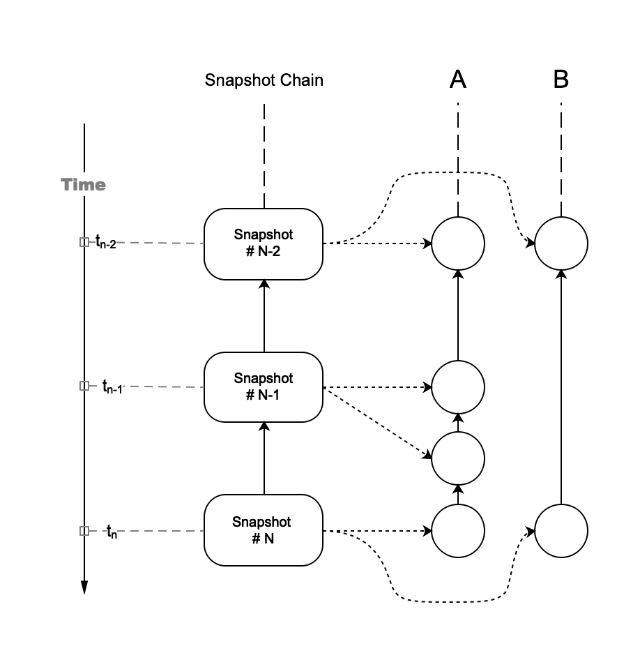
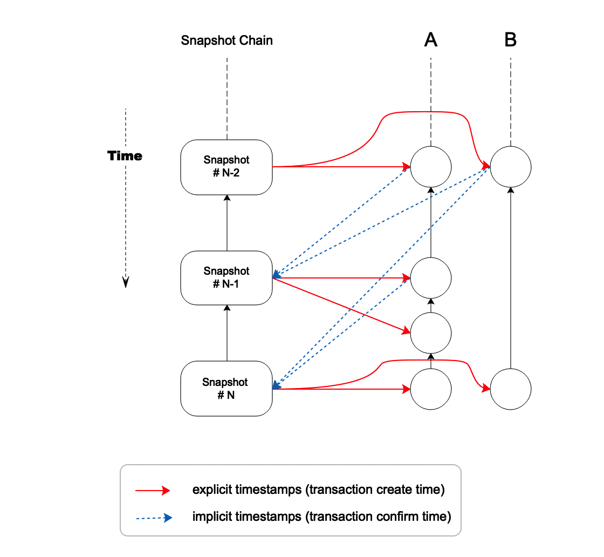
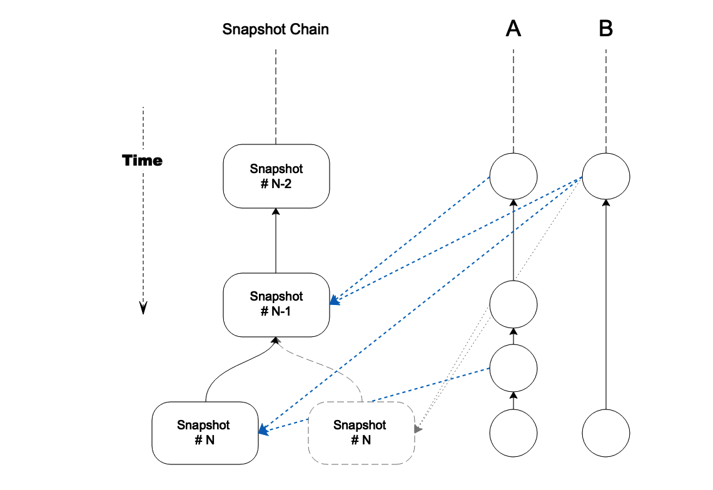

# VEP 5: Remove Explicit Snapshot Hash Reference as Timestamps

## Background

In Section 6.2.2(Resource Quantification) of Vite White Paper, it mentions

>Because snapshot chain is equivalent to a global clock, we can use it to quantify the resource usage of an account accurately. In each transaction, the Hash of a snapshot block is quoted, the height of the snapshot block is took as the timestamp of the transaction. Therefore, according to the difference between the two transaction timestamps, we can judge whether the interval between the two transactions is long enough.

Figure 1. Explicit Timestamps

In Figure 1, each transaction contains an explicit hash reference to snapshot block as transaction creation time. The main purpose of this timestamp is to calculate whether the resource consumption of an account exceeds its quota.

In addition to "explicit" timestamp, there is another "implicit" timestamp in the system. This "implicit" timestamp is the latest transaction hash for each account recorded in snapshot block, representing the "confirmation time" of a transaction.

The two types of timestamp cause two-way dependency between transactiongits and snapshot chain, as shown in Figure 2:

Figure 2. Explicit Timestamps and Implicit Timestamps

The red arrows indicate the references from transaction to snapshot block, representing explicit timestamps(the creation time of transaction).

The blue arrows indicate the references from snapshot block to transaction, representing implicit timestamps(the confirmation time of transaction).

## Impact of Snapshot Chain Fork on Timestamp

In structure, snapshot chain is actually a tree due to the possibility of forks. 
The newer the snapshot block is, the more likely it could be rolled back. Both types of timestamps will be impacted when rollback occurs. 
However, explicit timestamps will receive bigger impact, as explained below:

Figure 3. Explicit Timestamps with snapshot chain forks

In Figure 3, 
the snapshot block #N on the right hand side is rolled back and replaced by another forked snapshot block on the left side. 
All transactions referring to this snapshot block must be rolled back as well, including the last transactions in account A and B. 
This is because the hash value of snapshot block was involved in signing, as part of the transaction data. 
The transactions have to be re-signed and re-sent by the original users since the previously referenced snapshot block is invalid. 
However, re-signing transaction is very expensive and therefore should be avoided in practice. 
An alternative strategy is to reference an older snapshot block, which means the "trunk" part of the snapshot chain. Unfortunately, this approach deviates from the purpose of explicit timestamp as transaction creation time and also is hard to tell which block is most appropriate. 

A conclusion can be reached now that regardless of their benefit, explicit timestamps have this problem. In contrast, implicit timestamps do not have this problem.

Figure 4. Implicit Timestamps with snapshot chain forks

Implicit timestamps are simply discarded along with the snapshot block during a rollback. In the example of Figure 4, the second transaction of account A and first transaction of account B will be re-marked as unconfirmed. 
A forked snapshot block #N will produce a set of new implicit timestamps, but not necessarily the same as those in the original block. 
Since implicit timestamp is reversed reference, transactions in DAG ledger do not have to change. 
Therefore, it is not necessary for users to re-sign their transactions any more, making fork resolution simple.

## Calculate Resource Consumption with Implicit Timestamps

So, using implicit timestamps, is it still possible to accurately measure the resource usage of each account and calculate quota consumption? The answer is yes. 
As shown in Figure 2, if explicit timestamps are used in the original manner, then in two consecutive time slots from snapshot #N-2 to snapshot #N account A created 4 transactions, and account B created 2.

With implicit timestamps, in one time slot between snapshot #N-1 and snapshot #N, 2 transactions were confirmed for account A, and 1 transaction for account B. 
In this way, according to the total amount of resources consumed by transactions confirmed in each account within fixed period, average resource consumption can still be accurately measured. This allows discovering whether a new transaction will exceed the account' quota. 
Indeed, since the creation and confirmation of transactions are asynchronous in Vite, and because both transaction propagation and account state calculation take time, a small calculation gap may result from this mechanism.

However, it is reasonable to reduce the gap by extending statistical cycle, which means calculating average resource consumption for a longer period of time. 
In Vite's system, as long as the calculation scheme of resource consumption for different accounts is kept the same, this quota model based on confirmation time is feasible.

## Conclusions

Based on the discussion above, this proposal suggests to remove all explicit timestamps from Vite's ledger and keep only implicit timestamps.

In this proposal, although the exact creation time of transaction is no longer saved on chain and as consequence losing some semantics depending on timestamp, in general the impact is very limited. 
Particularly, quota model and related resource consumption calculation can still be implemented with implicit timestamp, aka "confirmation time".

This proposal can bring the following optimizations:

- Remove two-way dependency between DAG ledger and snapshot chain, so they can be constructed asynchronously
- Simplify rollback processing to increase system throughput
- Remove the need to re-sign transaction after rollback, and therefore simplifying client processing logic
- Reduce the size of DAG ledger
