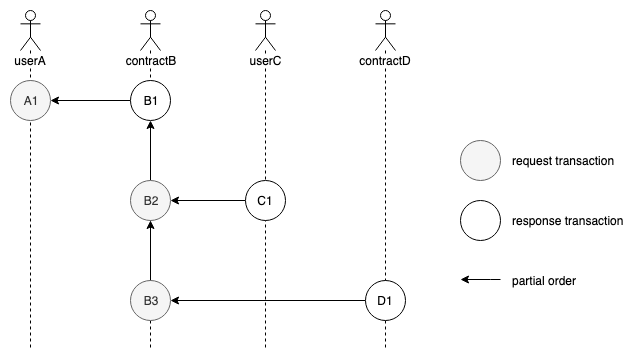
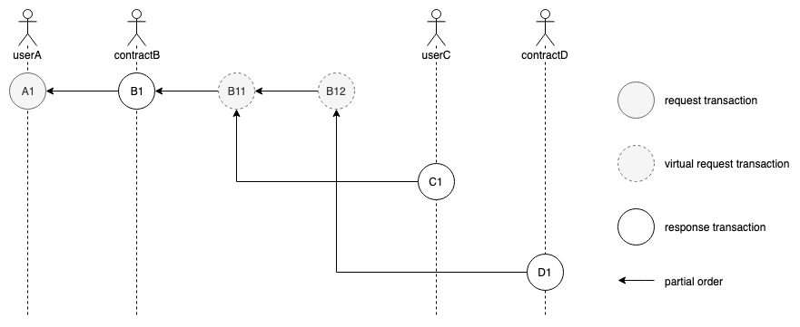

# VEP-7: Merge In-Contract Request Calls into Original Response as one Transaction

## Background

In Section 2.2(Definition of Ledger) of Vite White Paper, it explicitly defines:

>Transactions are divided into request and response transactions, each of which corresponds to a separate block, each account Ai corresponds to a chain, a transaction pair, and a response transaction referencing the hash of its corresponding request transaction.

In Vite, a request call to a smart contract may influence the status of multiple contracts or accounts. At this time, several new request transactions will be created and sent out after the response transaction is complete.

Let's see an example. User A sends a request transaction A1 to contract B, which executes business logic in a response transaction B1 and creates two new request transactions B2 and B3. 
Here B2 is a transfer transaction to user C while B3 calls contract D. Correspondingly, account C and contract D create related response transactions C1 and D1. In this example, 3 request blocks A1, B2, B3 and 3 response blocks B1, C1, D1 are created all together.

Figure 1

## Pros and Cons of Current Design

As shown in Figure 1, from the perspective of business logic, response transaction B1 and request transactions B2 and B3 can be deemed as one operation. But they are split into 3 blocks in practice.

Pros:

* Request transaction and response transaction are paired up, resulting in neater ledger structure. It is also convenient to query un-received transactions or transaction status (responded or not).

Cons:

* It is difficult to implement ACID semantic for in-contract request calls. In order to verify the response transaction of a contract, all relevant request transactions initiated by the response transaction should be verified at the same time because in-contract request transactions inherit the original response transaction's context and cannot be verified separately. 
Meanwhile, since all the transactions must be propagated independently in the network, if a specific node is down after sending out the response before broadcasting the newly-initiated request transactions, the contract chain will become incomplete due to missing blocks.

* Data redundancy has been caused on chain due to duplicated information stored both in response and requests. This includes block producer, block height, previous block hash and etc.

::: tip
Currently in TestNet, ACID on contract response-requests is guaranteed by removing signatures on in-contract request transactions, discarding in-contract request transactions received from the network but generating them by each node itself upon verification (the virtual machine will ensure the same transactions are generated on each node). 
:::

## Pros and Cons of Proposed Design

In the proposed design, in-contract request block B11 and B12 are merged into B1. As shown in Figure 2, the new design creates 1 request block A1 and 3 response blocks: B1, C1 and D1.

Figure 2

Pros:

* ACID is guaranteed perfectly in nature since the response transaction and in-contract request transactions are written into one block

* Duplicated data are removed since blocks are merged

* Request-response pair is retained since independent transaction hash is kept in the request, facilitating queries for un-received transactions or transaction status

Cons:

* None

## Conclusion

Based on the discussion above, this proposal suggests to merge in-contract request transactions into original response as one transaction, and keep request transaction hash.

The merged block may contain a response transaction and multiple request transactions. This will bring following benefits:

* ACID compliance on contract response transaction and newly-initiated in-contract request transactions in a graceful way. Easier for verification and transmission

* Lighter ledger space
